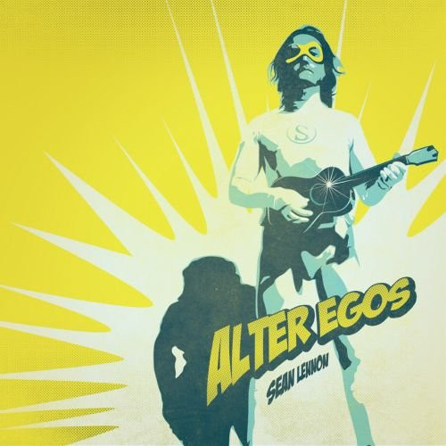

# Alter Egos

By Sean Lennon

## Album Data

[Discogs URL](https://www.discogs.com/release/4202729-Sean-Lennon-Alter-Egos)

- Label: Chimera Music
- Formats: Vinyl, LP
- Genres: Rock, Pop, Stage & Screen, Soundtrack
- Rating: 3.91
- Released: 2013-01-15
- Year: 2013
- Release ID: 4202729
- Media condition: 
- Sleeve condition: 
- Speed: 
- Weight: 
- Notes: 

## Album Tracks

| **Position** | **Title** | **Duration** |
|--------------|-----------|--------------|
| 1 | **Alter Egos Theme** |  |
| 2 | **My Hero** |  |
| 3 | **The Killer** |  |
| 4 | **The Conspiracy** |  |
| 5 | **Fridge Walks** |  |
| 6 | **Ms. Unseen** |  |
| 7 | **Dr. Invisible** |  |
| 8 | **Emily Vs. Claudel** |  |
| 9 | **The Capture** |  |
| 10 | **C-Thru's Theme** |  |
| 11 | **The Shrink** |  |
| 12 | **Love Life** |  |
| 13 | **Jimmy's Theme** |  |
| 14 | **The Supercore** |  |
| 15 | **The Fight** |  |
| 16 | **The Dance Part II** |  |
| 17 | **The Nephew** |  |
| 18 | **The Kiss** |  |
| 19 | **Mind Control** |  |
| 20 | **Exile** |  |

## Artist Roles

| **Name** | **Role** |
|----------|----------|
| **Sean Lennon** | Acoustic Guitar |
| **Sean Lennon** | Arranged By |
| **Charlotte Kemp Muhl** | Backing Vocals |
| **Jordan Galland** | Backing Vocals |
| **Sean Lennon** | Backing Vocals |
| **Sean Lennon** | Banjo |
| **Hideaki Aomori** | Bass Clarinet |
| **Clarice Jensen** | Cello |
| **Sean Lennon** | Chamberlin |
| **Hideaki Aomori** | Clarinet |
| **Charlotte Kemp Muhl** | Cover [Cover Photo] |
| **Geoffrey Thorpe** | Design [Cover Design] |
| **Geoffrey Thorpe** | Design [Package Design] |
| **Sean Lennon** | Drums |
| **Sean Lennon** | Electric Bass |
| **Sean Lennon** | Electric Guitar |
| **Sean Lennon** | Electric Upright Bass |
| **Scott Hollingsworth** | Engineer |
| **Hideaki Aomori** | Flute |
| **C. J. Camerieri** | French Horn |
| **Sean Lennon** | Harmonica |
| **Sean Lennon** | Harpsichord |
| **Sean Lennon** | MIDI Controller [MIDI Programming] |
| **Sean Lennon** | Mandolin |
| **Sean Lennon** | Mellotron |
| **Scott Hollingsworth** | Mixed By |
| **Sean Lennon** | Organ |
| **Sean Lennon** | Percussion |
| **Sean Lennon** | Performer |
| **Sean Lennon** | Piano |
| **Sean Lennon** | Producer |
| **Sean Lennon** | Synth |
| **Michael Davis** | Trombone |
| **C. J. Camerieri** | Trumpet |
| **Sean Lennon** | Vibraphone |
| **Rob Moose** | Viola |
| **Rob Moose** | Violin |
| **Sean Lennon** | Written By |

