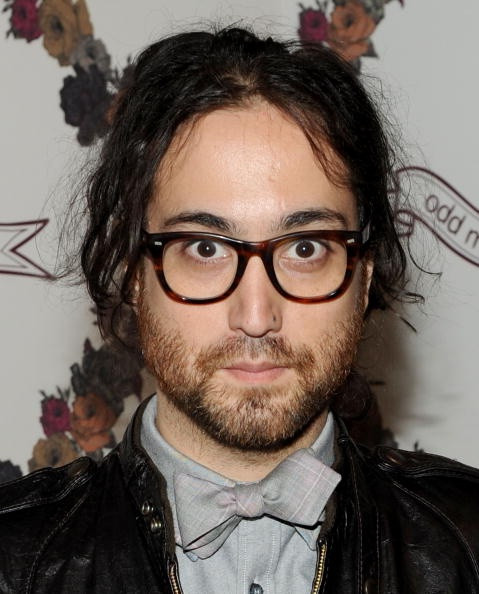

# Sean Lennon

## Artist Profile

Born on October 9, 1975, New York City, New York. Son of Yoko Ono and John Lennon. Half-brother of Julian Lennon. 

## Artist Links

- [http://www.seanonolennon.com/](http://www.seanonolennon.com/)
- [https://www.facebook.com/seanlennon](https://www.facebook.com/seanlennon)
- [https://www.instagram.com/sean_ono_lennon/](https://www.instagram.com/sean_ono_lennon/)
- [https://twitter.com/seanonolennon](https://twitter.com/seanonolennon)
- [https://en.wikipedia.org/wiki/Sean_Lennon](https://en.wikipedia.org/wiki/Sean_Lennon)
- [https://www.imdb.com/name/nm0005141/](https://www.imdb.com/name/nm0005141/)

## See also

- [Alter Egos](Alter_Egos.md)
