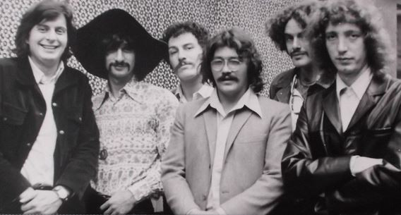

# Seatrain

## Artist Profile

Seatrain was an American roots fusion band based initially in Marin County, California, and later in Marblehead, Massachusetts. Seatrain was formed after the breakup of The Blues Project in 1969. The group, which recorded four albums, disbanded in 1973.

## Artist Links

- [http://en.wikipedia.org/wiki/Seatrain_(band)](http://en.wikipedia.org/wiki/Seatrain_(band))

## See also

- [Seatrain](Seatrain.md)
