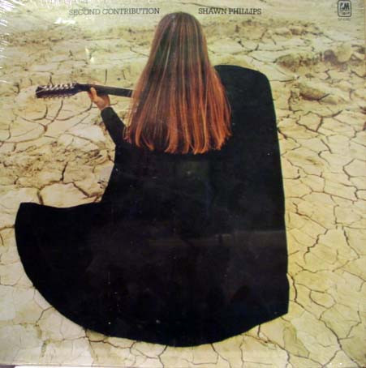

# Second Contribution

By Shawn Phillips

## Album Data

[Discogs URL](https://www.discogs.com/release/1462084-Shawn-Phillips-Second-Contribution)

- Label: A&M Records
- Formats: Vinyl, LP, Album
- Genres: Rock, Folk Rock, Soft Rock
- Rating: 4
- Released: 1970
- Year: 1970
- Release ID: 1462084
- Media condition: 
- Sleeve condition: 
- Speed: 
- Weight: 
- Notes: 

## Album Tracks

| **Position** | **Title** | **Duration** |
|--------------|-----------|--------------|
| A1 | **She Was Waitin' For Her Mother At The Station In Torino And You Know I Love You Baby But It's Getting Too Heavy To Laugh (Swwfhmatsitaykilybbigth)** | 4:54 |
| A2 | **Keep On** | 3:21 |
| A3 | **Sleepwalker** | 1:32 |
| A4 | **Song For Mr. C** | 3:49 |
| A5 | **The Ballad Of Casey Deiss** | 6:12 |
| B1 | **Song For Sagittarians** | 3:43 |
| B2 | **Lookin' Up Lookin' Down** | 3:55 |
| B3 | **Remedial Interruption** | 1:56 |
| B4 | **Whaz' Zat** | 1:56 |
| B5 | **Schmaltz Waltz** | 1:44 |
| B6 | **F Sharp Splendor** | 0:36 |
| B7 | **Steel Eyes** | 4:18 |

## Artist Roles

| **Name** | **Role** |
|----------|----------|
| **Paul Buckmaster** | Arranged By [Orchestra] |
| **Mike Doud (2)** | Art Direction [Director] |
| **Robin Geoffrey Cable** | Engineer |
| **Shawn Phillips (2)** | Guitar, Sitar, Vocals |
| **Anello Capuano** | Musician |
| **Poli Palmer** | Musician |
| **Barry Dean** | Musician [Bass, Guitar] |
| **Brian Odgers** | Musician [Bass] |
| **Bruce Rowland** | Musician [Drums] |
| **Harvey Burns** | Musician [Guitar] |
| **Jim Cregan** | Musician [Guitar] |
| **Gerry Salisbury** | Musician [Horn] |
| **Ann Odell** | Musician [Keyboards] |
| **Paul Buckmaster** | Musician [Keyboards] |
| **Peter Robinson** | Musician [Percussion, Keyboards] |
| **Sanders Nicholson** | Photography By |
| **Jonathan Weston** | Producer |
| **Shawn Phillips (2)** | Written-By |

