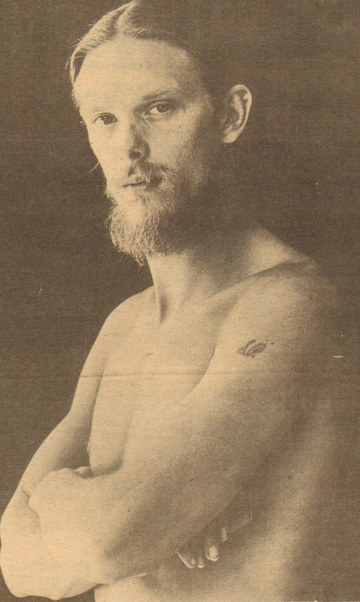

# Shawn Phillips

## Artist Profile

Shawn Phillips was born 3 February 1943 in Fort Worth, Texas, the son of spy novelist/poet James Atlee Phillips. Shawn Phillips has recorded 20 albums and numerous singles. He also did a lot of session work, including playing guitar, 12-string guitar and sitar on some of Donovan's recordings.

## Artist Links

- [http://www.shawnphillipsmusic.com/](http://www.shawnphillipsmusic.com/)
- [http://shawnphillips.wordpress.com/bio/](http://shawnphillips.wordpress.com/bio/)
- [http://www.onamrecords.com/myartists.php?artist=Shawn%20Phillips](http://www.onamrecords.com/myartists.php?artist=Shawn%20Phillips)
- [http://en.wikipedia.org/wiki/Shawn_Phillips](http://en.wikipedia.org/wiki/Shawn_Phillips)

## See also

- [Second Contribution](Second_Contribution.md)
