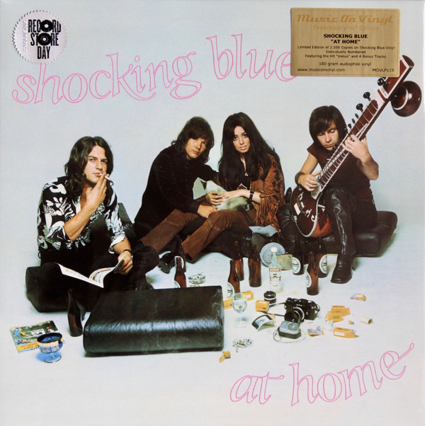

# At Home

By Shocking Blue

## Album Data

[Discogs URL](https://www.discogs.com/release/10163446-Shocking-Blue-At-Home)

- Label: Music On Vinyl
Red Bullet
- Formats: Vinyl, LP, Album, Limited Edition, Numbered, Reissue
- Genres: Rock, Pop Rock, Psychedelic Rock
- Rating: 4.47
- Released: 2017-04-22
- Year: 1969
- Release ID: 10163446
- Media condition: 
- Sleeve condition: 
- Speed: 
- Weight: 
- Notes: 

## Album Tracks

| **Position** | **Title** | **Duration** |
|--------------|-----------|--------------|
| A1 | **Boll Weevil** | 2:40 |
| A2 | **I'll Write Your Name Through The Fire** | 2:50 |
| A3 | **Acka Raga** | 3:10 |
| A4 | **Love Machine** | 3:15 |
| A5 | **I'm A Woman** | 3:00 |
| A6 | **Venus** | 3:07 |
| A7 | **California Here I Come** | 3:15 |
| A8 | **Poor Boy** | 4:50 |
| B1 | **Long And Lonesome Road** | 2:44 |
| B2 | **Love Buzz** | 3:40 |
| B3 | **The Butterfly And I** | 3:50 |
|  | **Bonus Tracks** |  |
| B4 | **Harley Davidson** | 2:39 |
| B5 | **Fireball Of Love** | 3:00 |
| B6 | **Hot Sand** | 2:35 |
| B7 | **Wild Wind** | 2:15 |

## Artist Roles

| **Name** | **Role** |
|----------|----------|
| **Dick Bakker** | Engineer |
| **Cees van Leeuwen (2)** | Management [Personal Manager] |
| **Robbie van Leeuwen** | Mixed By |
| **Cornelis Van Der Beek** | Performer |
| **Klaasje Van Der Wal** | Performer |
| **Mariska Veres** | Performer |
| **Robbie van Leeuwen** | Performer |
| **Ronnie Hertz** | Photography By |
| **Shocking Blue** | Producer |
| **Robbie van Leeuwen** | Written-By |

