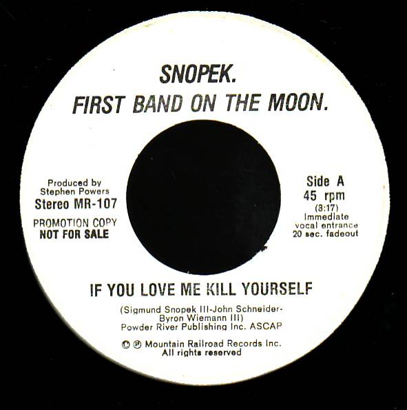

# If You Love Me Kill Yourself 

By Sigmund Snopek III

## Album Data

[Discogs URL](https://www.discogs.com/release/4198797-Snopek-First-Band-On-The-Moon-If-You-Love-Me-Kill-Yourself-)

- Label: Mountain Railroad Records
- Formats: Vinyl, 7", 45 RPM, Promo
- Genres: Rock, New Wave, Art Rock
- Rating: 3.8
- Released: 1980
- Year: 1980
- Release ID: 4198797
- Media condition: 
- Sleeve condition: 
- Speed: 
- Weight: 
- Notes: 

## Album Tracks

| **Position** | **Title** | **Duration** |
|--------------|-----------|--------------|
| A | **If You Love Me Kill Yourself** | 3:17 |
| B | **Solalex** | 6:24 |

## Artist Roles

| **Name** | **Role** |
|----------|----------|
| **Stephen Powers** | Producer |

