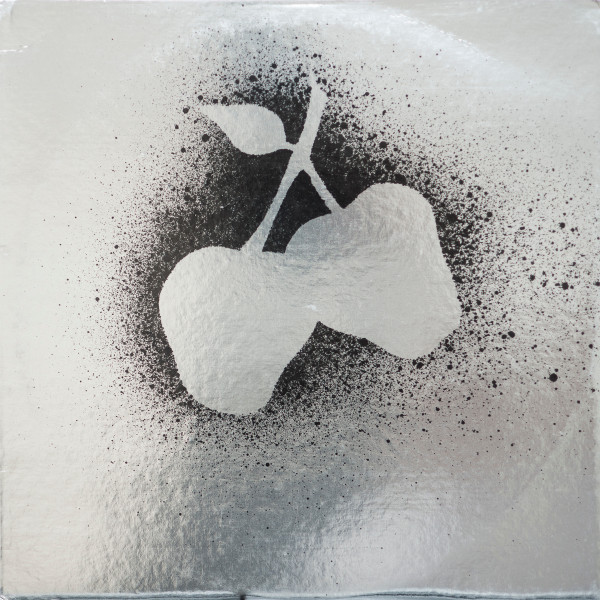

# Silver Apples

By Silver Apples

## Album Data

[Discogs URL](https://www.discogs.com/release/906717-Silver-Apples-Silver-Apples)

- Label: Kapp Records
- Formats: Vinyl, LP, Album, Stereo
- Genres: Electronic, Rock, Psychedelic Rock, Experimental
- Rating: 4.47
- Released: 1968
- Year: 1968
- Release ID: 906717
- Media condition: 
- Sleeve condition: 
- Speed: 
- Weight: 
- Notes: 

## Album Tracks

| **Position** | **Title** | **Duration** |
|--------------|-----------|--------------|
| A1 | **Oscillations** | 2:47 |
| A2 | **Seagreen Serenades** | 2:53 |
| A3 | **Lovefingers** | 4:10 |
| A4 | **Program** | 4:05 |
| A5 | **Velvet Cave** | 3:28 |
| B1 | **Whirly-Bird** | 2:39 |
| B2 | **Dust** | 3:42 |
| B3 | **Dancing Gods** | 5:55 |
| B4 | **Misty Mountain** | 2:38 |

## Artist Roles

| **Name** | **Role** |
|----------|----------|
| **Anonymous Arts** | Artwork |
| **Dan Taylor** | Composed By, Arranged By |
| **Simeon (3)** | Composed By, Arranged By |
| **Don Van Gordon** | Engineer [Sound] |
| **Barry Bryant** | Liner Notes, Executive-Producer |
| **John Walsh** | Other [Liaison] |
| **Dan Taylor** | Percussion |
| **Virginia Dwan** | Photography By |
| **Simeon (3)** | Synthesizer [The Simeon] |
| **Dan Taylor** | Vocals |
| **Simeon (3)** | Vocals |
| **Dan Taylor** | Written-By |
| **Eileen Lewellen** | Written-By |
| **Simeon (3)** | Written-By |
| **Stanley Warren** | Written-By |

