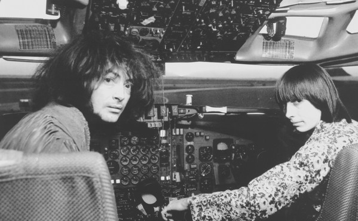

# Silver Apples

## Artist Profile

Decades after their brief yet influential career ground to a sudden halt due to being sued for exorbitant amounts by Pan Am Airlines, Silver Apples remain one of pop music's true enigmas: a surreal, almost unprecedented duo, their music explored interstellar drones and hums, pulsing rhythms and electronically-generated melodies years before similar ideas were adopted in the work of acolytes ranging from Suicide to Spacemen 3 to Laika. 
Silver Apples formed in New York in 1967 and comprised percussionist Danny Taylor and lead vocalist Simeon, who played an instrument also dubbed the Simeon, which (according to notes on the duo's self-titled 1968 debut LP) consisted of "nine audio oscillators and eighty-six manual controls... The lead and rhythm oscillators are played with the hands, elbows and knees and the bass oscillators are played with the feet." Although the utterly uncommercial record — an ingenious cacophony of beeps, buzzes and beats — sold poorly, the Silver Apples resurfaced a year later with their sophomore effort, 'Contact', another far-flung outing which fared no better than its predecessor. 
It was this record's cover, depicting the duo in the cockpit of a Pan Am airplane, that resulted in a legal battle that left the band unable to continue recording and releasing music. Suddenly it seemed they had disappeared into thin air. However, in 1996 the Silver Apples resurfaced, as Simeon and new partner Xian Hawkins released the single "Fractal Flow." American and European tours followed, and a year later a new LP, 'Beacon', was released to wide acclaim. The follow-up 'Decatur' appeared in 1998, and was soon joined by 'A Lake of Teardrops' (a collaboration with avowed fans Spectrum) as well as 'The Garden', the long-unreleased third and final effort from the original Simeon/Taylor partnership. 
However, on November 1, 1998, the Silver Apples' van crashed while returning from a New York gig; the accident left Simeon with a broken neck and spinal injuries, casting his continued musical career in grave doubt. Thankfully, Simeon recovered and continued playing live shows and recorded what was to be the final Silver Apples album 'Clinging To A Dream' in 2016.
Simeon Coxe died on September 8, 2020.

## Artist Links

- [https://www.silverapples.com/](https://www.silverapples.com/)
- [https://myspace.com/officialsilverapples](https://myspace.com/officialsilverapples)
- [https://en.wikipedia.org/wiki/Silver_Apples](https://en.wikipedia.org/wiki/Silver_Apples)
- [https://www.whosampled.com/Silver-Apples/](https://www.whosampled.com/Silver-Apples/)
- [https://vimeo.com/user4188400](https://vimeo.com/user4188400)

## See also

- [Silver Apples](Silver_Apples.md)
