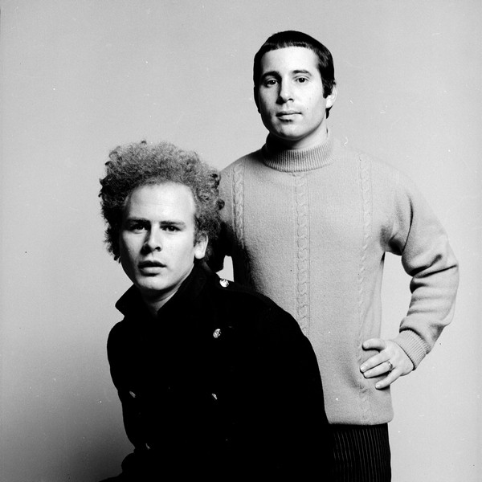

# Simon & Garfunkel

## Artist Profile

Simon & Garfunkel were an American folk rock duo consisting of singer-songwriter Paul Simon and singer Art Garfunkel. They were one of the most popular recording artists of the 1960s and became counterculture icons of the decade's social revolution.

Inducted into Rock And Roll Hall of Fame in 1990 (Performer).

## Artist Links

- [https://www.simonandgarfunkel.com/](https://www.simonandgarfunkel.com/)
- [https://www.facebook.com/SimonandGarfunkel/](https://www.facebook.com/SimonandGarfunkel/)
- [https://twitter.com/simongarfunkel](https://twitter.com/simongarfunkel)
- [https://www.youtube.com/channel/UCvj9Q8jeaaXlj2OprcRraaw](https://www.youtube.com/channel/UCvj9Q8jeaaXlj2OprcRraaw)
- [https://www.youtube.com/channel/UCcIszZPVuroWlLXu4HjZdEw](https://www.youtube.com/channel/UCcIszZPVuroWlLXu4HjZdEw)
- [https://myspace.com/simonandgarfunkel](https://myspace.com/simonandgarfunkel)
- [https://en.wikipedia.org/wiki/Simon_%26_Garfunkel](https://en.wikipedia.org/wiki/Simon_%26_Garfunkel)

## See also

- [The Complete Columbia Albums Collection](The_Complete_Columbia_Albums_Collection.md)
