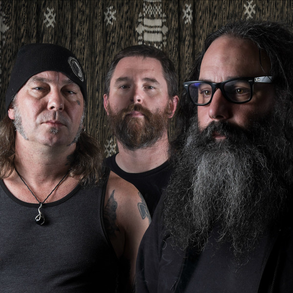

# Sleep

## Artist Profile

From San Jose, California.

Kyuss' partner in crime in creating the Stoner Rock genre. Ozzy Osbourne went on record as saying Sleep were the closest band he'd heard to Black Sabbath's original 70s style and feeling.

Sleep emerged in 1990 from the remains of Asbestosdeath, which featured members Al Cisneros (vocals/bass), Matt Pike (guitar), and Chris Hakius (drums). Along with 2nd guitar Justin Marler, the band released "Volume One" in 1991. Marler departed the band afterwards and the remaining trio recorded the group's follow up album, "Sleep's Holy Mountain" the following year. The album is now considered one of the most seminal releases in the "stoner rock" genre. This led to the band signing a major label deal with London Records. The label financed the band's next project, which was a single track called "Dopesmoker", which ran 63 minutes. The band informed the label that they had no intentions to edit the track nor tour behind it, as they were breaking up. London balked at the idea of releasing an album that contained a single, hour-long song. The band recorded a second version, this one clocking in at 52 minutes and re-titled "Jerusalem", but London shelved the release and the band split. In 1999, the Music Cartel released "Jerusalem" and 4 years later, Tee Pee Records issued "Dopesmoker", the latter of which tended to be considered the "definitive" version by many fans (although the band members expressed displeasure with both versions).

Following the split, Matt Pike formed High On Fire, while Al Cisneros and Chris Hakius eventually reunited in OM (8). Sleep's legend grew in the years following its split and in 2009 Pike, Cisneros, and Hakius reunited to perform two sets at All Tomorrow's Parties. The following year, Pike and Cisneros resumed touring as Sleep, with drummer Jason Roeder (of Neurosis) replacing Chris Hakius.

## Artist Links

- [http://weedian.com](http://weedian.com)
- [https://sleep.bandcamp.com](https://sleep.bandcamp.com)
- [http://www.myspace.com/rifffilledland](http://www.myspace.com/rifffilledland)
- [http://www.facebook.com/officialsleep](http://www.facebook.com/officialsleep)
- [https://www.instagram.com/sleeptheband](https://www.instagram.com/sleeptheband)
- [https://twitter.com/sleep_official](https://twitter.com/sleep_official)
- [https://en.wikipedia.org/wiki/Sleep_(band)](https://en.wikipedia.org/wiki/Sleep_(band))

## See also

- [Sleep's Holy Mountain](Sleeps_Holy_Mountain.md)
