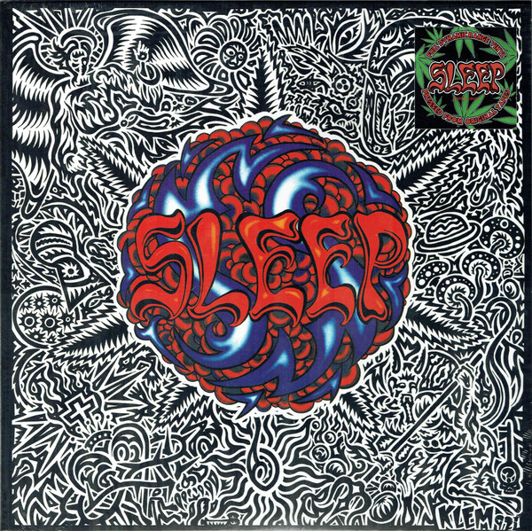

# Sleep's Holy Mountain

By Sleep

## Album Data

[Discogs URL](https://www.discogs.com/release/9700901-Sleep-Sleeps-Holy-Mountain)

- Label: Earache
- Formats: Vinyl, LP, Album, Limited Edition, Reissue, Remastered, Repress, Stereo
- Genres: Rock, Doom Metal, Stoner Rock, Heavy Metal
- Rating: 4.58
- Released: 2017-01-27
- Year: 1992
- Release ID: 9700901
- Media condition: 
- Sleeve condition: 
- Speed: 
- Weight: 
- Notes: 

## Album Tracks

| **Position** | **Title** | **Duration** |
|--------------|-----------|--------------|
| A1 | **Dragonaut** |  |
| A2 | **The Druid** |  |
| A3 | **Evil Gypsy / Solomon's Theme** |  |
| A4 | **Some Grass** |  |
| A5 | **Aquarian** |  |
| B1 | **Holy Mountain** |  |
| B2 | **Inside The Sun** |  |
| B3 | **From Beyond** |  |
| B4 | **Nain's Baptism** |  |

## Artist Roles

| **Name** | **Role** |
|----------|----------|
| **Robert Klem** | Artwork |
| **Al Cisneros** | Bass Vocals |
| **Chris Hakius** | Drums |
| **Matt Pike** | Guitar |

