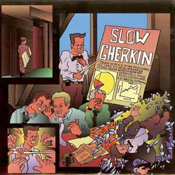

# Death Of A Salesman

By Slow Gherkin

## Album Data

[Discogs URL](https://www.discogs.com/release/4813829-Slow-Gherkin-Death-Of-A-Salesman)

- Label: Join, Or Die Records
Join, Or Die Records
- Formats: Vinyl, 7", 33 ⅓ RPM, EP
- Genres: Rock, Punk, Ska
- Rating: 0
- Released: 1994
- Year: 1997
- Release ID: 4813829
- Media condition: 
- Sleeve condition: 
- Speed: 
- Weight: 
- Notes: 

## Album Tracks

| **Position** | **Title** | **Duration** |
|--------------|-----------|--------------|
| A1 | **Zen And Soccer** |  |
| A2 | **Covert Advertising** |  |
| B1 | **Salsa III** |  |
| B2 | **Drunken Sailor** |  |

## Artist Roles

| **Name** | **Role** |
|----------|----------|
| **Peter Cowan (2)** | Accordion |
| **Phil Boutelle** | Alto Saxophone, Vocals |
| **Ian Berry (5)** | Artwork [Cover Art] |
| **Zack Kent** | Bass |
| **James Rickman** | Booking |
| **Matt Porter** | Booking |
| **James Rickman** | Drums, Vocals |
| **Megan Rickman** | Graphics [Vinyl] |
| **A.J. Marquez** | Guitar, Vocals |
| **Bill Lightner** | Mastered By |
| **Kym Agresti** | Photography By [Photograph] |
| **Steve Loveless** | Recorded By, Mixed By |
| **Rob Pratt** | Tenor Saxophone, Vocals |
| **Brigham Hausman** | Trombone |
| **Josh Montgomery (2)** | Trumpet |
| **Matt Porter** | Trumpet |
| **Slow Gherkin** | Written-By [All Of The Music] |
| **Tom Rickman (2)** | Written-By [Main Horn Line] |

