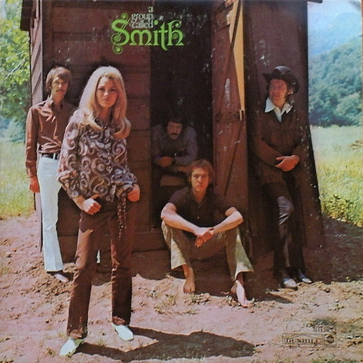

# A Group Called Smith

By Smith

## Album Data

[Discogs URL](https://www.discogs.com/release/1224369-Smith-A-Group-Called-Smith)

- Label: Dunhill
ABC Records
- Formats: Vinyl, LP, Album, Reissue, Stereo
- Genres: Rock, Rock & Roll, Blues Rock, Psychedelic Rock
- Rating: 3.92
- Released: 1971
- Year: 1969
- Release ID: 1224369
- Media condition: 
- Sleeve condition: 
- Speed: 
- Weight: 
- Notes: 

## Album Tracks

| **Position** | **Title** | **Duration** |
|--------------|-----------|--------------|
| A1 | **Let's Get Together** | 3:32 |
| A2 | **I Don't Believe** | 3:40 |
| A3 | **Tell Him No** | 3:25 |
| A4 | **Who Do You Love?** | 2:55 |
| A5 | **Baby It's You** | 3:25 |
| B1 | **Last Time** | 4:44 |
| B2 | **I Just Wanna Make Love To You** | 2:39 |
| B3 | **Mojaleskey Ridge** | 2:31 |
| B4 | **Let's Spend The Night Together** | 2:55 |
| B5 | **I'll Hold Out My Hand** | 3:06 |

## Artist Roles

| **Name** | **Role** |
|----------|----------|
| **Jimmie Haskell** | Arranged By [Horns] |
| **Bill Cooper** | Engineer |
| **Bill Schnee** | Engineer |
| **Phil Kaye** | Engineer |
| **Bob Evans (5)** | Performer |
| **Gayle McCormick** | Performer |
| **James Richard Cliburn** | Performer |
| **Jerry Carter** | Performer |
| **Larry Moss** | Performer |
| **Paul Slaughter** | Photography By |
| **Joel Sill** | Producer |
| **Steve Barri** | Producer |

