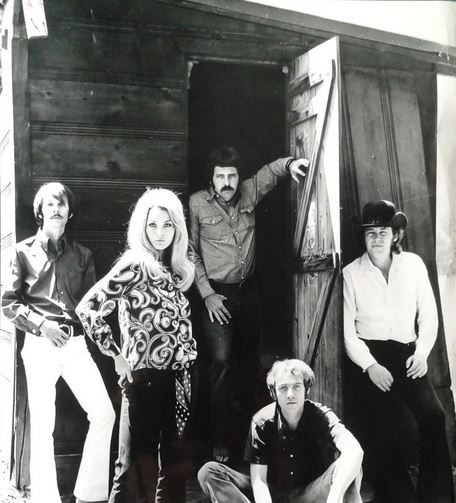

# Smith

## Artist Profile

American Rock band, formed in Los Angeles, California in late 60's.
Most of their material consisted of covers of popular Rock and R&B tunes.
The group disbanded in 1971.

## Artist Links

- [https://en.wikipedia.org/wiki/Smith_(band)](https://en.wikipedia.org/wiki/Smith_(band))

## See also

- [A Group Called Smith](A_Group_Called_Smith.md)
- [Take A Look Around](Take_A_Look_Around.md)
