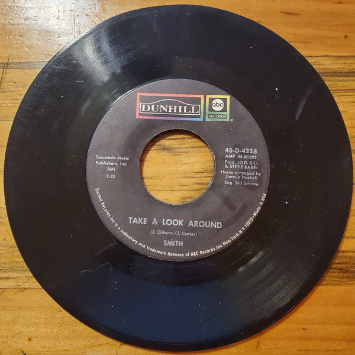

# Take A Look Around

By Smith

## Album Data

[Discogs URL](https://www.discogs.com/release/6755763-Smith-Take-A-Look-Around)

- Label: ABC/Dunhill Records
- Formats: Vinyl, 7", 45 RPM, Single
- Genres: Rock, Classic Rock
- Rating: 0
- Released: 1970
- Year: 1970
- Release ID: 6755763
- Media condition: 
- Sleeve condition: 
- Speed: 
- Weight: 
- Notes: 

## Album Tracks

| **Position** | **Title** | **Duration** |
|--------------|-----------|--------------|
| A | **Take A Look Around** | 2:33 |
| B | **Mojalesky Ridge** | 2:30 |

## Artist Roles

| **Name** | **Role** |
|----------|----------|
| **Jimmie Haskell** | Arranged By [Horns] |
| **Joel Sill** | Producer |
| **Steve Barri** | Producer |

