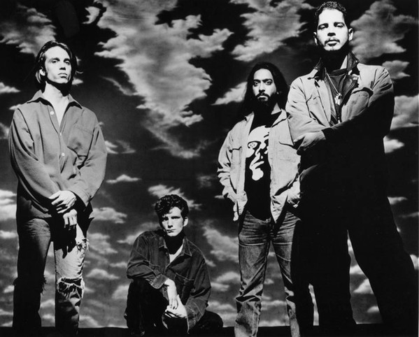

# Soundgarden

## Artist Profile

As one of the first bands to record for the legendary Sub Pop Records, Soundgarden is generally regarded as one of the founding fathers of grunge, even though most of their work was of a far more rock/metallic nature than the likes of Pearl Jam, Mudhoney, or Nirvana. From a metallic standpoint, their peak was 1991's Badmotorfinger, with the later albums showing a more alternative side to the band (and also produced their biggest hit single, "Black Hole Sun"). The band parted ways amicably in April of 1997 to pursue other interests. Most notable of these was vocalist Chris Cornell joining forces with the core of Rage Against The Machine in Audioslave.
At precisely midnight on January 1, 2010, U.S. EST, Chris Cornell posted on his Twitter and Facebook: "The 12 year break is over & school is back in session. Knights of the Soundtable ride again!"
On May 18, 2017, around midnight, vocalist Chris Cornell was found dead in MGM Grand hotel room after a show in Detroit.

Fan club & merchandise: Knights Of The Soundtable.

## Artist Links

- [https://www.soundgardenworld.com/](https://www.soundgardenworld.com/)
- [https://bandtraq.com/soundgarden](https://bandtraq.com/soundgarden)
- [https://www.facebook.com/Soundgarden](https://www.facebook.com/Soundgarden)
- [https://instagram.com/soundgarden](https://instagram.com/soundgarden)
- [https://twitter.com/soundgarden](https://twitter.com/soundgarden)
- [http://web.stargate.net/soundgarden/](http://web.stargate.net/soundgarden/)
- [https://en.wikipedia.org/wiki/Soundgarden](https://en.wikipedia.org/wiki/Soundgarden)
- [https://www.youtube.com/user/SoundgardenVEVO](https://www.youtube.com/user/SoundgardenVEVO)

## See also

- [Superunknown](Superunknown.md)
