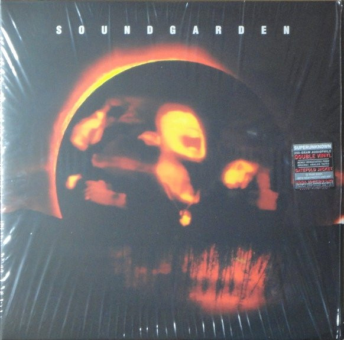

# Superunknown

By Soundgarden

## Album Data

[Discogs URL](https://www.discogs.com/release/5783331-Soundgarden-Superunknown)

- Label: A&M Records
- Formats: Vinyl, LP, Album, Reissue, Remastered
- Genres: Rock, Alternative Rock, Grunge
- Rating: 4.7
- Released: 2014-06-03
- Year: 1994
- Release ID: 5783331
- Media condition: 
- Sleeve condition: 
- Speed: 
- Weight: 
- Notes: 

## Album Tracks

| **Position** | **Title** | **Duration** |
|--------------|-----------|--------------|
| A1 | **Let Me Drown** |  |
| A2 | **My Wave** |  |
| A3 | **Fell On Black Days** |  |
| A4 | **Mailman** |  |
| B1 | **Superunknown** |  |
| B2 | **Head Down** |  |
| B3 | **Black Hole Sun** |  |
| C1 | **Spoonman** |  |
| C2 | **Limo Wreck** |  |
| C3 | **The Day I Tried To Live** |  |
| C4 | **Kickstand** |  |
| D1 | **Fresh Tendrils** |  |
| D2 | **4th Of July** |  |
| D3 | **Half** |  |
| D4 | **Like Suicide** |  |
| D5 | **She Likes Surprises** |  |

## Artist Roles

| **Name** | **Role** |
|----------|----------|
| **Josh Graham** | Art Direction [Reissue], Design [Reissue] |
| **Ben Shepherd** | Bass, Vocals |
| **Kelk** | Design [Original Front Cover] |
| **Matt Cameron** | Drums, Percussion |
| **Jason Corsaro** | Engineer |
| **Adam Kasper** | Engineer [Assisted By], Mixed By [Assisted By] |
| **Ron McMaster** | Lacquer Cut By |
| **Kim Thayil** | Lead Guitar |
| **Laffitte Management Group** | Management |
| **The Artists Organization** | Management |
| **William Morris Agency** | Management [Booking Agency] |
| **Flood Bumstead MacCready & McCarthy** | Management [Business] |
| **Provident Financial Management** | Management [Business] |
| **VWC** | Management [Business] |
| **King, Holmes, Paterno & Berliner** | Management [Legal Counsel] |
| **Stephen Marcussen** | Mastered By [Reissue] |
| **Alex Reed** | Mixed By |
| **Brendan O'Brien** | Mixed By |
| **Brendan O'Brien** | Mixed By |
| **Michael Beinhorn** | Mixed By |
| **Michael Beinhorn** | Mixed By |
| **Kevin Westenberg** | Photography By [Band Photos, Reissue] |
| **Michael Beinhorn** | Producer |
| **Soundgarden** | Producer |
| **Jeff Fura** | Producer [Reissue] |
| **Liuba Shapiro** | Product Manager [Reissue] |
| **Monique McGuffin** | Production Manager [Reissue] |
| **Joe Hadlock** | Recorded By [Assisted By] |
| **Kim Thayil** | Supervised By [Reissue] |
| **Chris Cornell** | Vocals, Guitar |

