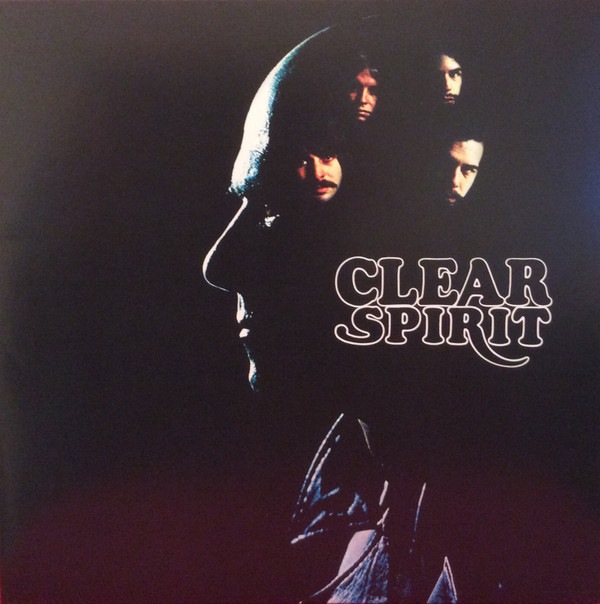

# Clear

By Spirit

## Album Data

[Discogs URL](https://www.discogs.com/release/6320488-Spirit-Clear)

- Label: Steamhammer
- Formats: Vinyl, LP, Album, Reissue
- Genres: Rock, Psychedelic Rock
- Rating: 4.44
- Released: 2013-11-00
- Year: 1969
- Release ID: 6320488
- Media condition: 
- Sleeve condition: 
- Speed: 
- Weight: 
- Notes: 

## Album Tracks

| **Position** | **Title** | **Duration** |
|--------------|-----------|--------------|
| A1 | **Dark Eyed Woman** | 3:06 |
| A2 | **Apple Orchard** | 4:05 |
| A3 | **So Little Time To Fly** | 2:45 |
| A4 | **Ground Hog** | 3:01 |
| A5 | **Cold Wind** | 3:20 |
| A6 | **Policeman's Ball** | 2:18 |
| B1 | **Ice** | 5:53 |
| B2 | **Give A Life, Take A Life** | 3:25 |
| B3 | **I'm Truckin'** | 2:24 |
| B4 | **Clear** | 4:08 |
| B5 | **Caught** | 3:10 |
| B6 | **New Dope In Town** | 4:24 |

## Artist Roles

| **Name** | **Role** |
|----------|----------|
| **Tom Wilkes (2)** | Design |
| **Armin Steiner** | Engineer |
| **Eric Weinbang** | Engineer |
| **John Stachowiak** | Engineer |
| **Guy Webster** | Photography By |
| **Lou Adler** | Producer |
| **Ed Cassidy** | Written-By |
| **Jay Ferguson** | Written-By |
| **John Locke** | Written-By |
| **Mark Andes** | Written-By |
| **Randy California** | Written-By |

