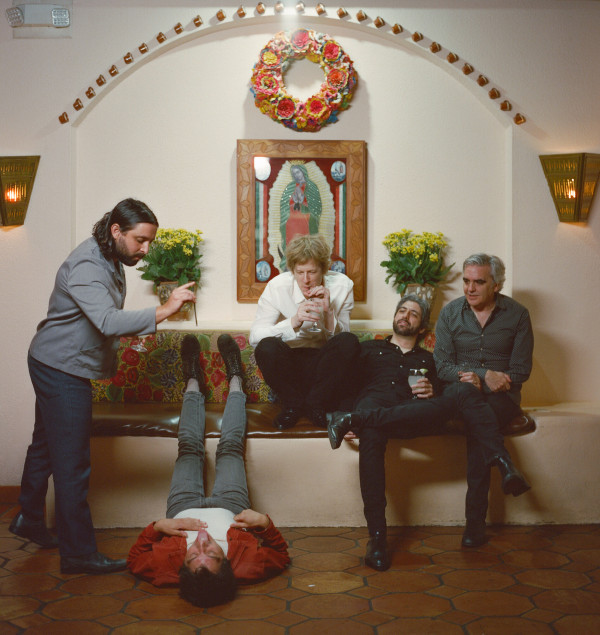

# Spoon

## Artist Profile

American rock band formed 1993 in Austin, Texas. The band is the brainchild of Britt Daniel (vocals, guitar) and Jim Eno (drums), who are the only consistent members.

## Artist Links

- [http://www.spoontheband.com/](http://www.spoontheband.com/)
- [https://www.facebook.com/spoontheband/](https://www.facebook.com/spoontheband/)
- [https://twitter.com/spoontheband](https://twitter.com/spoontheband)
- [https://www.instagram.com/spoontheband/](https://www.instagram.com/spoontheband/)
- [http://spoontheband.tumblr.com/](http://spoontheband.tumblr.com/)
- [https://myspace.com/spoon](https://myspace.com/spoon)
- [https://www.bandsintown.com/Spoon](https://www.bandsintown.com/Spoon)
- [https://www.songkick.com/artists/169103-spoon](https://www.songkick.com/artists/169103-spoon)
- [https://spoon.kungfustore.com/](https://spoon.kungfustore.com/)
- [https://soundcloud.com/spoontheband](https://soundcloud.com/spoontheband)
- [https://www.youtube.com/user/spoontheband](https://www.youtube.com/user/spoontheband)
- [https://www.youtube.com/user/SpoonVEVO](https://www.youtube.com/user/SpoonVEVO)
- [https://en.wikipedia.org/wiki/Spoon_(band)](https://en.wikipedia.org/wiki/Spoon_(band))

## See also

- [Hot Thoughts](Hot_Thoughts.md)
