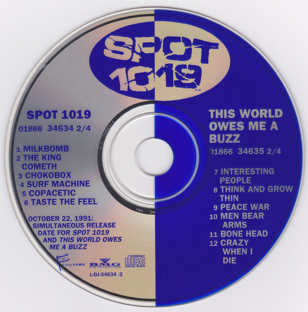

# Spot 1019

By Spot 1019

## Album Data

[Discogs URL](https://www.discogs.com/release/1935251-Spot-1019-Spot-1019)

- Label: Pitch-A-Tent
- Formats: Vinyl, LP, Album
- Genres: Rock, Stoner Rock, Indie Rock, Parody
- Rating: 4.38
- Released: 1986
- Year: 1986
- Release ID: 1935251
- Media condition: 
- Sleeve condition: 
- Speed: 
- Weight: 
- Notes: 

## Album Tracks

| **Position** | **Title** | **Duration** |
|--------------|-----------|--------------|
| A1 | **Prisoner Of Mankind** | 2:05 |
| A2 | **Dinky Dog The Demon Master** | 1:46 |
| A3 | **Milkbomb** | 2:12 |
| A4 | **The King Cometh** | 3:37 |
| A5 | **Chokobox** | 2:18 |
| A6 | **Long Tomorrow** | 2:37 |
| A7 | **Seltzer Blue** | 2:05 |
| A8 | **Sons Of The Revolution** | 4:33 |
| B1 | **Surf Machine** | 4:13 |
| B2 | **El Diabolico** | 1:14 |
| B3 | **True Story** | 2:22 |
| B4 | **Copacetic** | 5:13 |
| B5 | **16 Wheels** | 2:26 |
| B6 | **Ol' Tigers** | 1:49 |
| B7 | **Taste The Feel** | 1:41 |

## Artist Roles

| **Name** | **Role** |
|----------|----------|
| **Jimb Lyons** | Bass, Vocals, Other [Tater-tots] |
| **Greg Winter (2)** | Drums, Vocals, Percussion [Glue Gun, Anvil] |
| **Howard Johnston** | Engineer |
| **Wade Olson** | Engineer |
| **Scott Levinson** | Engineer [2nd] |
| **Peter Tripodi** | Guitar, Vocals |
| **Spot 1019** | Producer |
| **Wally Sound** | Producer |
| **Joe Sloan** | Vocals, Harmonica, Effects [Special] |
| **Spot 1019** | Written-By |

