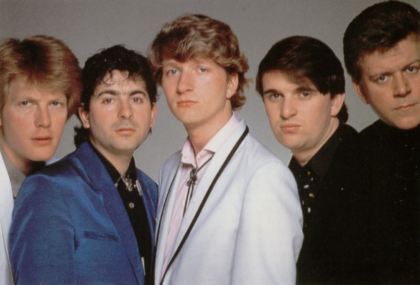

# Squeeze

## Artist Profile

Rock to New Wave band, formed in March 1974 in London, UK.
Jools Holland played the keyboards from 1974 to 1980 and 1985 to 1990.

## Artist Links

- [http://www.squeezeofficial.com/](http://www.squeezeofficial.com/)
- [http://www.onamrecords.com/myartists.php?artist=Squeeze](http://www.onamrecords.com/myartists.php?artist=Squeeze)
- [https://en.wikipedia.org/wiki/Squeeze_(band)](https://en.wikipedia.org/wiki/Squeeze_(band))

## See also

- [Argybargy](Argybargy.md)
- [Sweets From A Stranger](Sweets_From_A_Stranger.md)
