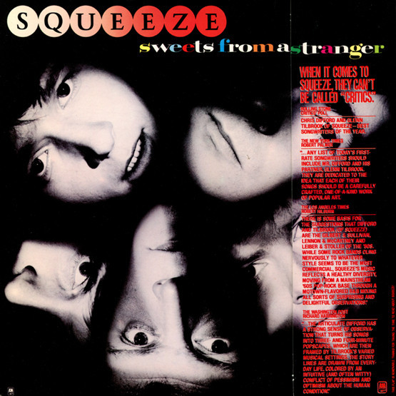

# Sweets From A Stranger

By Squeeze

## Album Data

[Discogs URL](https://www.discogs.com/release/1404274-Squeeze-Sweets-From-A-Stranger)

- Label: A&M Records
- Formats: Vinyl, LP, Album, Stereo
- Genres: Electronic, Rock, New Wave, Synth-pop
- Rating: 3.5
- Released: 1982
- Year: 1982
- Release ID: 1404274
- Media condition: 
- Sleeve condition: 
- Speed: 
- Weight: 
- Notes: 

## Album Tracks

| **Position** | **Title** | **Duration** |
|--------------|-----------|--------------|
| A1 | **Out Of Touch** | 3:50 |
| A2 | **I Can't Hold On** | 3:34 |
| A3 | **Points Of View** | 4:13 |
| A4 | **Stranger Than The Stranger On The Shore** | 3:18 |
| A5 | **Onto The Dance Floor** | 3:38 |
| A6 | **When The Hangover Strikes** | 4:31 |
| B1 | **Black Coffee In Bed** | 6:12 |
| B2 | **I've Returned** | 2:36 |
| B3 | **Tongue Like A Knife** | 4:10 |
| B4 | **His House Her Home** | 3:25 |
| B5 | **The Very First Dance** | 3:18 |
| B6 | **The Elephant Ride** | 3:23 |

## Artist Roles

| **Name** | **Role** |
|----------|----------|
| **Del Newman** | Arranged By [Orchestral] |
| **John Bentley** | Bass, Backing Vocals |
| **Simon Ryan** | Design [Cover] |
| **Squeeze (2)** | Design [Cover] |
| **Gilson Lavis** | Drums |
| **Butch Yates** | Engineer [Assistant] |
| **Don Snow** | Keyboards, Backing Vocals |
| **Frank DeLuna** | Lacquer Cut By [⚇ In Runouts] |
| **Frank DeLuna** | Mastered By |
| **Michael Putland** | Photography By [Cover] |
| **Phil McDonald** | Producer |
| **Squeeze (2)** | Producer |
| **Chris Difford** | Written-By, Guitar, Vocals |
| **Glenn Tilbrook** | Written-By, Guitar, Vocals |

