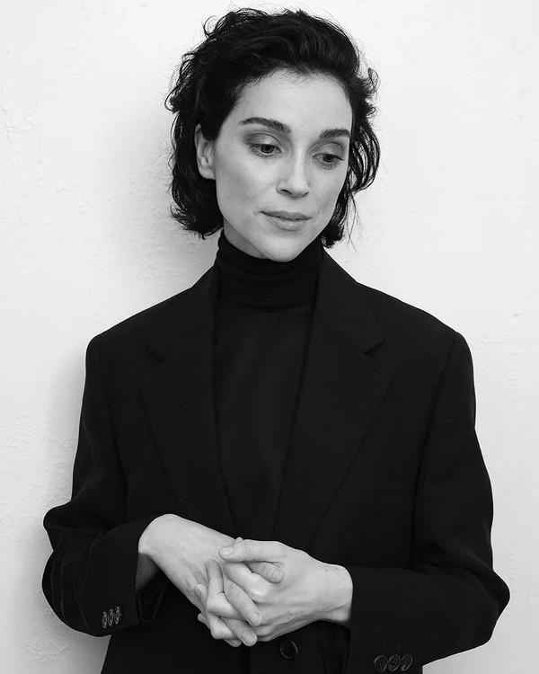

# St. Vincent

## Artist Profile

Annie Clark (born September 28, 1982 in Tulsa, Oklahoma) is a singer / multi-instrumentalist and performs under the name St. Vincent. She began learning guitar at the age of 12, having been influenced by her uncle, Tuck Andress, of the jazz duo Tuck &amp; Patti. Clark plays piano, organ, drums, bass guitar, theremin, and vibraphone. Has collaborated and/or toured with The Polyphonic Spree, David Byrne, The Black Keys, and Sufjan Stevens, among others. In 2013, Clark received the Smithsonian American Ingenuity Award, and in 2014, she performed with remaining members of Nirvana at their Rock and Roll Hall of Fame induction. St. Vincent won the 2015 Grammy Award for Best Alternative Music Album.

## Artist Links

- [http://www.ilovestvincent.com/](http://www.ilovestvincent.com/)
- [http://www.facebook.com/St.Vincent](http://www.facebook.com/St.Vincent)
- [http://twitter.com/st_vincent](http://twitter.com/st_vincent)
- [http://instagram.com/st_vincent](http://instagram.com/st_vincent)
- [http://myspace.com/stvincent](http://myspace.com/stvincent)
- [http://soundcloud.com/st_vincent](http://soundcloud.com/st_vincent)
- [http://www.youtube.com/user/ilovestvincent1](http://www.youtube.com/user/ilovestvincent1)
- [http://vimeo.com/ilovestvincent](http://vimeo.com/ilovestvincent)

## See also

- [Masseduction](Masseduction.md)
- [St. Vincent](St_Vincent.md)
