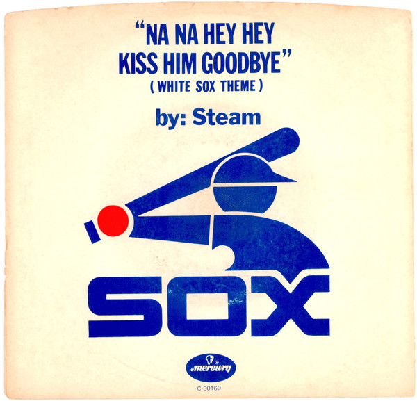

# Na Na Hey Hey Kiss Him Goodbye / Don't Stop Lovin' Me

By Steam

## Album Data

[Discogs URL](https://www.discogs.com/release/5015419-Steam-Na-Na-Hey-Hey-Kiss-Him-Goodbye-Dont-Stop-Lovin-Me)

- Label: Mercury
- Formats: Vinyl, 7", Single
- Genres: Rock, Pop, Pop Rock
- Rating: 4.5
- Released: null
- Year: 1969
- Release ID: 5015419
- Media condition: 
- Sleeve condition: 
- Speed: 
- Weight: 
- Notes: 

## Album Tracks

| **Position** | **Title** | **Duration** |
|--------------|-----------|--------------|
| A | **Na Na Hey Hey Kiss Him Goodbye** | 3:45 |
| B | **Don't Stop Lovin' Me** | 3:19 |

## Artist Roles

| **Name** | **Role** |
|----------|----------|
| **Paul Leka** | Producer |
| **Dale Frashuer** | Written-By |
| **Gary DeCarlo** | Written-By |
| **Paul Leka** | Written-By |

