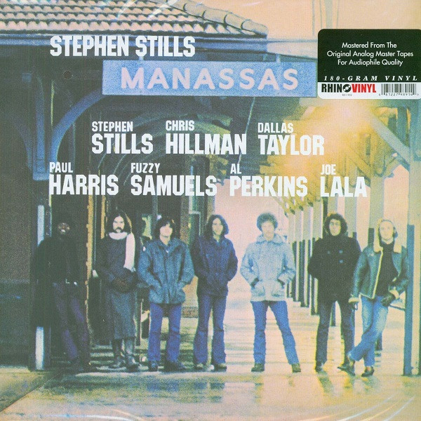

# Manassas

By Stephen Stills

## Album Data

[Discogs URL](https://www.discogs.com/release/2752255-Stephen-Stills-Manassas-Manassas)

- Label: Atlantic
- Formats: Vinyl, LP, Album, Reissue
- Genres: Rock, Folk, World, & Country, Folk Rock, Country Rock, Classic Rock
- Rating: 4.43
- Released: 2010
- Year: 1972
- Release ID: 2752255
- Media condition: 
- Sleeve condition: 
- Speed: 
- Weight: 
- Notes: 

## Album Tracks

| **Position** | **Title** | **Duration** |
|--------------|-----------|--------------|
|  | **The Raven** |  |
| A1 | **Song Of Love** | 3:28 |
| A2a | **Rock & Roll Crazies** |  |
| A2b | **Cuban Bluegrass** | 3:34 |
| A3 | **Jet Set (Sigh)** | 4:25 |
| A4 | **Anyway** | 3:21 |
| A5 | **Both Of Us (Bound To Lose)** | 3:00 |
|  | **The Wilderness** |  |
| B1 | **Fallen Eagle** | 2:05 |
| B2 | **Jesus Gave Love Away For Free** | 3:00 |
| B3 | **Colorado** | 2:53 |
| B4 | **So Begins The Task** | 4:00 |
| B5 | **Hide It So Deep** | 2:46 |
| B6 | **Don't Look At My Shadow** | 2:31 |
|  | **Consider** |  |
| C1 | **It Doesn't Matter** | 2:30 |
| C2 | **Johnny's Garden** | 2:46 |
| C3 | **Bound To Fall** | 1:54 |
| C4 | **How Far** | 2:52 |
| C5 | **Move Around** | 4:17 |
| C6 | **The Love Gangster** | 2:52 |
|  | **Rock & Roll Is Here To Stay** |  |
| D1 | **What To Do** | 4:44 |
| D2 | **Right Now** | 3:00 |
| D3 | **The Treasure (Take One)** | 8:09 |
| D4 | **Blues Man** | 4:05 |

## Artist Roles

| **Name** | **Role** |
|----------|----------|
| **Roger Bush** | Acoustic Bass |
| **Bill Wyman** | Bass |
| **Calvin "Fuzzy" Samuels** | Bass |
| **Joe Lala** | Congas, Percussion, Timbales, Voice |
| **Dallas Taylor** | Drums, Producer |
| **Stephen Stills** | Electric Piano, Guitar, Organ, Clavinet [Clavenette], Slide Guitar [Bottleneck], Piano, Producer, Voice |
| **Jerry Aiello** | Electric Piano, Organ, Clavinet [Clavenette], Piano |
| **Paul Harris (2)** | Electric Piano, Organ, Clavinet [Clavenette], Piano, Piano [Tack] |
| **Howard Albert** | Engineer, Recorded By, Mixed By |
| **Ron Albert** | Engineer, Recorded By, Mixed By |
| **Byron Berline** | Fiddle |
| **Chris Hillman** | Guitar, Mandolin, Producer, Voice |
| **Al Perkins** | Guitar, Steel Guitar, Voice |
| **Sydney George** | Harmonica |
| **Al Wilson** | Other [In Tribute] |
| **Duane Allman** | Other [In Tribute] |
| **Jimi Hendrix** | Other [In Tribute] |
| **Chris Hillman** | Written-By |
| **Stephen Stills** | Written-By |

