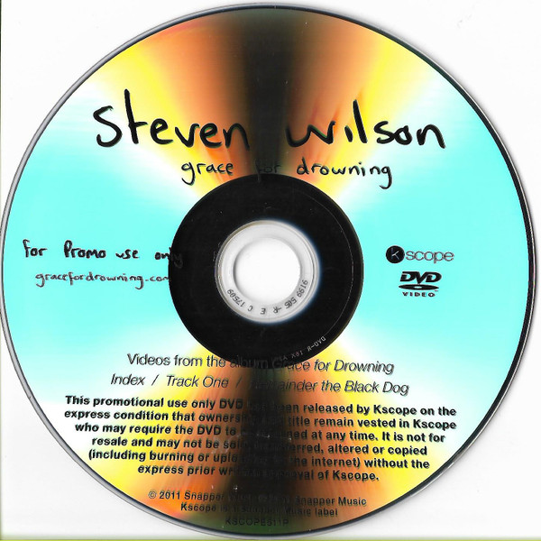

# Grace For Drowning

By Steven Wilson

## Album Data

[Discogs URL](https://www.discogs.com/release/3130731-Steven-Wilson-Grace-For-Drowning)

- Label: Kscope
- Formats: Vinyl, LP, Album, Limited Edition
- Genres: Rock, Art Rock, Prog Rock, Experimental, Avant-garde Jazz
- Rating: 4.54
- Released: 2011-09-26
- Year: 2011
- Release ID: 3130731
- Media condition: 
- Sleeve condition: 
- Speed: 
- Weight: 
- Notes: 

## Album Tracks

| **Position** | **Title** | **Duration** |
|--------------|-----------|--------------|
|  | **Vol 1 - Deform To Form A Star** |  |
| A1 | **Grace For Drowning** | 2:00 |
| A2 | **Sectarian** | 7:45 |
| A3 | **Deform To Form A Star** | 8:00 |
| B1 | **No Part Of Me** | 5:45 |
| B2 | **Postcard** | 4:30 |
| B3 | **Raider Prelude** | 2:30 |
| B4 | **Remainder The Black Dog** | 9:30 |
|  | **Vol 2 - Like Dust I Have Cleared From My Eye** |  |
| C1 | **Raider II** | 23:15 |
| D1 | **Belle De Jour** | 3:00 |
| D2 | **Index** | 4:45 |
| D3 | **Track One** | 4:15 |
| D4 | **Like Dust I Have Cleared From My Eye** | 8:00 |

## Artist Roles

| **Name** | **Role** |
|----------|----------|
| **Carl Glover (4)** | Artwork, Design |
| **Mat Collis** | Engineer [At Koolworld] |
| **Andy Leff** | Management |
| **Alx Leeks** | Management [Assistant] |
| **Paschal Byrne** | Mastered By |
| **Bettina Ejlersen** | Photography By [Assistant], Film Technician [Assistant] |
| **Lasse Hoile** | Photography By, Film Director [Films] |
| **Steven Wilson** | Written-By, Producer, Mixed By |

