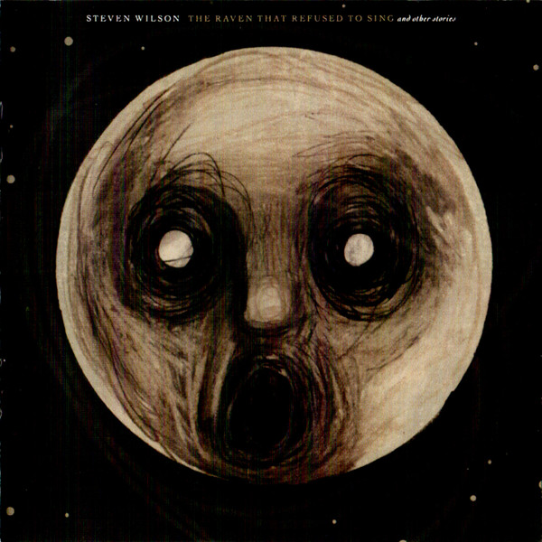

# The Raven That Refused To Sing (And Other Stories)

By Steven Wilson

## Album Data

[Discogs URL](https://www.discogs.com/release/4327479-Steven-Wilson-The-Raven-That-Refused-To-Sing-And-Other-Stories)

- Label: Kscope
- Formats: Vinyl, LP, Album, Stereo
- Genres: Jazz, Rock, Art Rock, Prog Rock, Fusion
- Rating: 4.71
- Released: 2013-02-25
- Year: 2013
- Release ID: 4327479
- Media condition: 
- Sleeve condition: 
- Speed: 
- Weight: 
- Notes: 

## Album Tracks

| **Position** | **Title** | **Duration** |
|--------------|-----------|--------------|
| A | **Luminol** | 12:10 |
| B1 | **Drive Home** | 7:37 |
| B2 | **The Holy Drinker** | 10:13 |
| C1 | **The Pin Drop** | 5:03 |
| C2 | **The Watchmaker** | 11:42 |
| D | **The Raven That Refused To Sing** | 7:57 |

## Artist Roles

| **Name** | **Role** |
|----------|----------|
| **Dave Stewart** | Arranged By [Strings] |
| **Nick Beggs** | Bass Guitar, Backing Vocals |
| **Josh Dick** | Booking [America] |
| **Steve Martin (18)** | Booking [America] |
| **The Agency Group** | Booking [Concert Booking By] |
| **Neil Warnock** | Booking [Europe] |
| **Marco Minnemann** | Drums, Percussion |
| **Adam Holzman** | Electric Piano [Fender Rhodes], Organ [Hammond], Piano, Synthesizer [Minimoog] |
| **Brendan Dekora** | Engineer [Assistant Engineer] |
| **Theo Travis** | Flute [Flutes], Saxophone [Saxophones], Clarinet |
| **Hajo Mueller** | Illustration [Conceived And Illustrated By] |
| **MK (11)** | Lacquer Cut By |
| **Carl Glover (4)** | Layout [Final Layout] |
| **Guthrie Govan** | Lead Guitar |
| **Andy Leff** | Management |
| **Acme Music** | Management [Andy Leff For] |
| **Alan Parsons** | Producer [Associate Producer], Engineer [Recording Engineer] |
| **Steven Wilson** | Producer, Mixed By |
| **Perry Montague-Mason** | Soloist [Strings] |
| **The London Session Orchestra** | Strings [Performed By] |
| **Steven Wilson** | Vocals, Mellotron, Keyboards, Guitar [Guitars] |
| **Steven Wilson** | Written-By |

