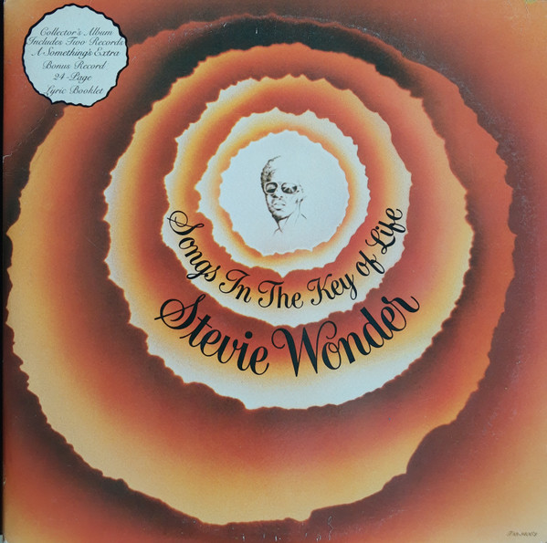

# Songs In The Key Of Life

By Stevie Wonder

## Album Data

[Discogs URL](https://www.discogs.com/release/2927062-Stevie-Wonder-Songs-In-The-Key-Of-Life)

- Label: Tamla
- Formats: Vinyl
Vinyl
All Media, LP, 7", 33 ⅓ RPM, EP, Album, Stereo
- Genres: Funk / Soul, Soul, Funk
- Rating: 4.36
- Released: 1976
- Year: 1976
- Release ID: 2927062
- Media condition: 
- Sleeve condition: 
- Speed: 
- Weight: 
- Notes: 

## Album Tracks

| **Position** | **Title** | **Duration** |
|--------------|-----------|--------------|
| A1 | **Love's In Need Of Love Today** | 7:05 |
| A2 | **Have A Talk With God** | 2:42 |
| A3 | **Village Ghetto Land** | 3:25 |
| A4 | **Contusion** | 3:45 |
| A5 | **Sir Duke** | 3:52 |
| B1 | **I Wish** | 4:12 |
| B2 | **Knocks Me Off My Feet** | 3:35 |
| B3 | **Pastime Paradise** | 3:20 |
| B4 | **Summer Soft** | 4:16 |
| B5 | **Ordinary Pain** | 6:22 |
| C1 | **Isn't She Lovely** | 6:33 |
| C2 | **Joy Inside My Tears** | 6:29 |
| C3 | **Black Man** | 8:29 |
| D1 | **Ngiculela - Es Una Historia - I Am Singing** | 3:48 |
| D2 | **If It's Magic** | 3:11 |
| D3 | **As** | 7:07 |
| D4 | **Another Star** | 8:19 |
|  | **A Something's Extra Bonus Record** |  |
| E1 | **Saturn** | 4:54 |
| E2 | **Ebony Eyes** | 4:10 |
| F1 | **All Day Sucker** | 5:06 |
| F2 | **Easy Goin' Evening (My Mama's Call)** | 3:58 |

## Artist Roles

| **Name** | **Role** |
|----------|----------|
| **Don Hunter** | Effects [Special Effects] |
| **Dr. Larry Scott** | Effects [Special Effects] |
| **Fountain Jones** | Effects [Special Effects] |
| **John Harris (11)** | Effects [Special Effects] |
| **Nelson Hayes** | Effects [Special Effects] |
| **Gary Olazabal** | Engineer |
| **John Fischbach** | Engineer |
| **Howie Lindeman** | Engineer [Assistant Engineering, Hit Factory] |
| **Rick Smith (2)** | Engineer [Assistant Engineering, Record Plant, Los Angeles] |
| **Steve Smith (7)** | Engineer [Assistant Engineering, Record Plant, Los Angeles] |
| **Chris Morris (2)** | Engineer [Assistant Engineering, Sausalito] |
| **David Henson** | Engineer [Assistant Engineering] |
| **Stevie Wonder** | Lead Guitar |
| **Andrew Berliner** | Mastered By |
| **Jeff Sanders** | Mastered By |
| **Stevie Wonder** | Producer, Arranged By |
| **Charles Brewer** | Programmed By |
| **John Fischbach** | Programmed By |
| **Stevie Wonder** | Programmed By |
| **Gary Olazabal** | Technician [Bass EQ] |

