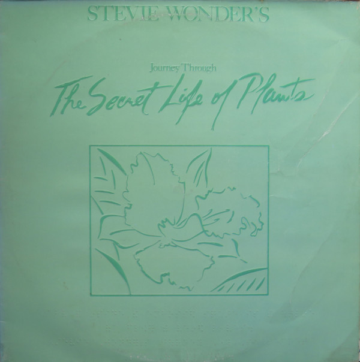

# Stevie Wonder's Journey Through The Secret Life Of Plants

By Stevie Wonder

## Album Data

[Discogs URL](https://www.discogs.com/release/3458476-Stevie-Wonder-Stevie-Wonders-Journey-Through-The-Secret-Life-Of-Plants)

- Label: Tamla
- Formats: Vinyl, LP, Album
- Genres: Electronic, Jazz, Funk / Soul, Pop, Jazz-Funk, Soul, Disco
- Rating: 3.79
- Released: 1979-10-30
- Year: 1979
- Release ID: 3458476
- Media condition: 
- Sleeve condition: 
- Speed: 
- Weight: 
- Notes: 

## Album Tracks

| **Position** | **Title** | **Duration** |
|--------------|-----------|--------------|
| A1 | **Earth's Creation** | 4:06 |
| A2 | **The First Garden** | 2:33 |
| A3 | **Voyage To India** | 6:23 |
| A4 | **Same Old Story** | 3:45 |
| A5 | **Venus' Flytrap And The Bug** | 2:24 |
| A6 | **Ai No, Sono** | 2:05 |
| B1 | **Seasons** | 2:53 |
| B2 | **Power Flower** | 5:31 |
| B3 | **Send One Your Love (Music)** | 3:05 |
| B4 | **Race Babbling** | 8:51 |
| C1 | **Send One Your Love** | 4:02 |
| C2 | **Outside My Window** | 5:29 |
| C3 | **Black Orchid** | 3:48 |
| C4 | **Ecclesiastes** | 3:44 |
| C5 | **Kesse Ye Lolo De Ye** | 3:00 |
| C6 | **Come Back As A Flower** | 3:23 |
| D1 | **A Seed's A Star And Tree Medley** | 5:41 |
| D2 | **The Secret Life Of Plants** | 4:28 |
| D3 | **Tree** | 5:55 |
| D4 | **Finale** | 6:47 |

## Artist Roles

| **Name** | **Role** |
|----------|----------|
| **John Cabalka** | Art Direction |
| **Keith Harris (2)** | Coordinator [Album Cover Coordination] |
| **Jay Mark** | Engineer [Additional] |
| **John Fischbach** | Engineer [Additional], Programmed By [Synthesizer] |
| **Ann Bolling** | Engineer [Assistant] |
| **Bob Harlan** | Engineer [Assistant] |
| **Charles Brewer** | Engineer [Assistant] |
| **Jim Dougherty** | Engineer [Assistant] |
| **Laura Livingston** | Engineer [Assistant] |
| **Lindy Griffin** | Engineer [Assistant] |
| **Gary Olazabal** | Engineer, Mixed By, Producer [Associate], Programmed By [Synthesizer] |
| **Margo Zafer Nahas** | Illustration [Album Package Illustration] |
| **Ginny Livingston** | Layout |
| **Abdoulaye Soumare** | Liner Notes [Bambara Translation] |
| **Kenji Miura** | Liner Notes [Japanese Translation] |
| **Mary Ann Monkoshi** | Liner Notes [Japanese Translation] |
| **Yoshi J. Maejima** | Liner Notes [Japanese Translation] |
| **Stevie Wonder** | Lyrics By |
| **Stan Ricker** | Mastered By |
| **Stevie Wonder** | Music By, Instruments, Producer, Programmed By [Synthesizer] |
| **Bill Wolf** | Programmed By [Synthesizer, Sequencer] |
| **Clark Spangler** | Programmed By [Synthesizer, Sequencer] |
| **Gordon Bahary** | Programmed By [Synthesizer, Sequencer] |
| **Harry Mandell** | Technician [Computer Music Melodian Design] |

