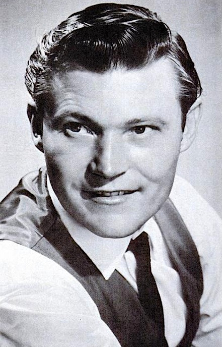

# Stonewall Jackson

## Artist Profile

American country singer/songwriter and musician born November 6, 1932 in Tabor City, North Carolina; died December 4, 2021. Brother of songwriter Wade Jackson (2).

## Artist Links

- [http://www.stonewalljacksoncountry.com/](http://www.stonewalljacksoncountry.com/)
- [http://www.cmt.com/artists/az/jackson_stonewall/artist.jhtml](http://www.cmt.com/artists/az/jackson_stonewall/artist.jhtml)
- [http://www.myspace.com/wadejackson](http://www.myspace.com/wadejackson)
- [https://en.wikipedia.org/wiki/Stonewall_Jackson_(musician)](https://en.wikipedia.org/wiki/Stonewall_Jackson_(musician))
- [https://www.imdb.com/name/nm1268881/](https://www.imdb.com/name/nm1268881/)

## See also

- [Wings Of A Dove](Wings_Of_A_Dove.md)
