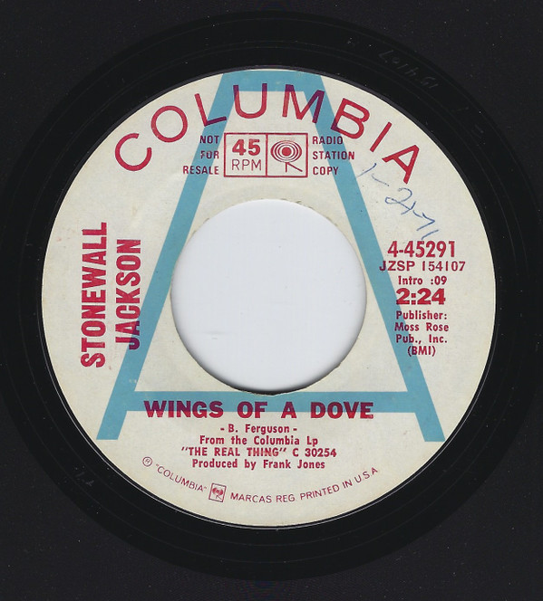

# Wings Of A Dove

By Stonewall Jackson

## Album Data

[Discogs URL](https://www.discogs.com/release/9499153-Stonewall-Jackson-Wings-Of-A-Dove)

- Label: Columbia
- Formats: Vinyl, 7", 45 RPM, Promo
- Genres: Folk, World, & Country, Country
- Rating: 0
- Released: 1971
- Year: 1970
- Release ID: 9499153
- Media condition: 
- Sleeve condition: 
- Speed: 
- Weight: 
- Notes: 

## Album Tracks

| **Position** | **Title** | **Duration** |
|--------------|-----------|--------------|
| A | **Wings Of A Dove** | 2:24 |
| B | **Save A Little Place For Me** | 2:38 |

## Artist Roles

| **Name** | **Role** |
|----------|----------|
| **Frank Jones (2)** | Producer |

