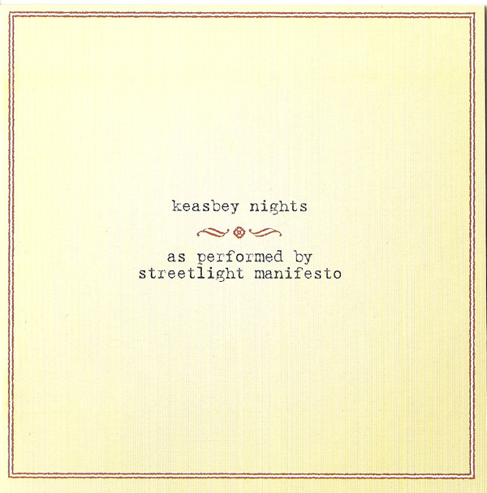

# Keasbey Nights

By Streetlight Manifesto

## Album Data

[Discogs URL](https://www.discogs.com/release/4917886-Streetlight-Manifesto-Keasbey-Nights)

- Label: Victory Records
- Formats: Vinyl, LP, Album, Limited Edition, Reissue
- Genres: Rock, Ska, Punk
- Rating: 4.54
- Released: 2013-09-03
- Year: 2006
- Release ID: 4917886
- Media condition: 
- Sleeve condition: 
- Speed: 
- Weight: 
- Notes: 

## Album Tracks

| **Position** | **Title** | **Duration** |
|--------------|-----------|--------------|
| A1 | **Dear Sergio** |  |
| A2 | **Sick And Sad** |  |
| A3 | **Keasbey Nights** |  |
| A4 | **Day In, Day Out** |  |
| A5 | **Walking Away** |  |
| A6 | **Giving Up, Giving In** |  |
| A7 | **On & On & On** |  |
| A8 | **Riding The Fourth Wave** |  |
| B1 | **This One Goes Out To...** |  |
| B2 | **Supernothing** |  |
| B3 | **9mm And A Three Piece Suit** |  |
| B4 | **Kristina She Don't Know I Exist** |  |
| B5 | **As The Footsteps Die Out Forever** |  |
| B6 | **1234 1234** |  |

## Artist Roles

| **Name** | **Role** |
|----------|----------|
| **Dan Ross (2)** | Baritone Saxophone, Alto Saxophone |
| **Chris Pazsik** | Bass, Backing Vocals [Bgd Vocals] |
| **Rob Thatcher** | Body Percussion [Hand Percussion] |
| **Christopher Thatcher** | Drums |
| **Jay Franco** | Mastered By |
| **Tomas Kalnoky** | Recorded By, Mixed By |
| **Jim Conti** | Tenor Saxophone |
| **Mike Soprano** | Trombone |
| **James Egan** | Trumpet, Backing Vocals [Bgd Vocals] |
| **Colin Bell (2)** | Vocals [Gang] |
| **Jeff Smith (31)** | Vocals [Gang] |
| **Kenny Holland (2)** | Vocals [Gang] |
| **Knowles (2)** | Vocals [Gang] |
| **Rob Thatcher** | Vocals [Gang] |
| **Streetlight Manifesto** | Vocals [Gang] |
| **Tomas Kalnoky** | Vocals, Guitar |
| **Tomas Kalnoky** | Words By, Music By |

