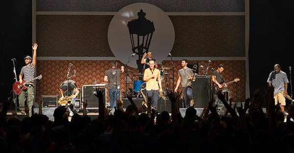

# Streetlight Manifesto

## Artist Profile

A ska punk band from New Brunswick, New Jersey, lead by former Catch Twenty-Two member Tomas Kalnoky.
Formed in 2002 by several artists from Bandits Of The Acoustic Revolution as well as some other musicians.
In September 2004, founding member Josh Ansley announced his departure to pursue an acting career.
In January 2005 left another founding member, James Egan.

Current members:
 Tomas Kalnoky – lead vocals, guitar (2002–present)
 Matt Stewart – trumpet, backing vocals (2007–present)
 Nadav Nirenberg - trombone, backing vocals (2010–present)
 Jim Conti – vocals, tenor and alto saxophone (2002–present)
 Mike Brown – baritone and alto saxophone, backing vocals (2005–present)
 Pete McCullough – bass, backing vocals (2006–present)
 Chris Thatcher – drums (2003–present)

Former members:
 Jamie Egan - trumpet, trombone (2002-2005)
 Delano Bonner - trumpet (2005-2007)
 Mike Soprano - trombone, backing vocals (2003-2010)
 Pete Sibilia - tenor saxophone (2002)
 Dan Ross - baritone saxophone and alto saxophone (2002-2005)
 Josh Ansley - bass (2002-2004)
 Chris Paszik - bass (2004-2006)
 Stuart Karmatz - drums (2002)
 Paul Lowndes - drums (2002-2003)

## Artist Links

- [http://streetlightmanifesto.com/](http://streetlightmanifesto.com/)
- [https://www.facebook.com/SManifesto](https://www.facebook.com/SManifesto)
- [http://smanifesto.tumblr.com/](http://smanifesto.tumblr.com/)
- [http://twitter.com/smanifesto](http://twitter.com/smanifesto)
- [http://en.wikipedia.org/wiki/Streetlight_Manifesto](http://en.wikipedia.org/wiki/Streetlight_Manifesto)

## See also

- [Keasbey Nights](Keasbey_Nights.md)
