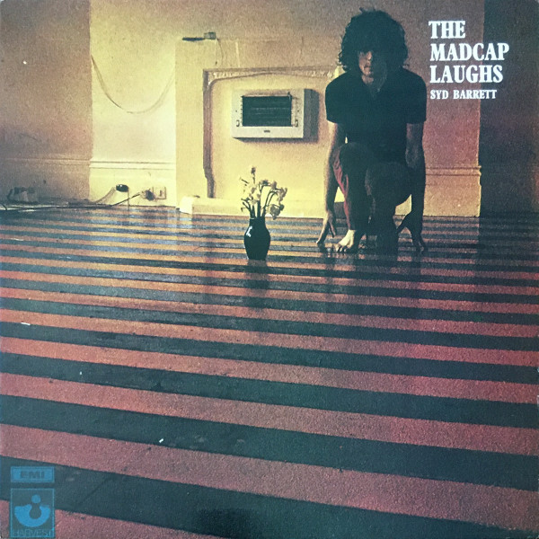

# The Madcap Laughs

By Syd Barrett

## Album Data

[Discogs URL](https://www.discogs.com/release/6511559-Syd-Barrett-The-Madcap-Laughs)

- Label: Harvest
Harvest
- Formats: Vinyl, LP, Album, Stereo
- Genres: Rock, Psychedelic Rock
- Rating: 4.44
- Released: 1970
- Year: 1970
- Release ID: 6511559
- Media condition: 
- Sleeve condition: 
- Speed: 
- Weight: 
- Notes: 

## Album Tracks

| **Position** | **Title** | **Duration** |
|--------------|-----------|--------------|
| A1 | **Terrapin** | 5:00 |
| A2 | **No Good Trying** | 3:26 |
| A3 | **Love You** | 2:25 |
| A4 | **No Man's Land** | 3:50 |
| A5 | **Dark Globe** | 2:10 |
| A6 | **Here I Go** | 3:13 |
| B1 | **Octopus** | 3:45 |
| B2 | **Golden Hair** | 1:56 |
| B3 | **Long Gone** | 2:47 |
| B4 | **She Took A Long Cold Look** |  |
| B5 | **Feel** |  |
| B6 | **If It's In You** |  |
| B7 | **Late Night** | 3:12 |

## Artist Roles

| **Name** | **Role** |
|----------|----------|
| **Syd Barrett** | Composed By |
| **Hipgnosis (2)** | Cover, Design |
| **Jeff Jarratt** | Engineer |
| **Michael Sheady** | Engineer |
| **Peter Mew** | Engineer |
| **Phil McDonald** | Engineer |
| **Tony Clark** | Engineer |
| **James Joyce** | Lyrics By |
| **Mick Rock** | Photography By [Cover] |
| **David Gilmour** | Producer |
| **Malcolm Jones** | Producer |
| **Roger Waters** | Producer |

