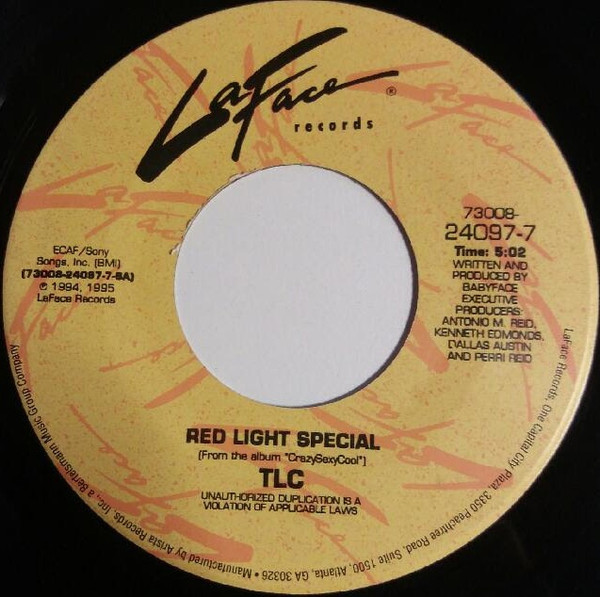

# Red Light Special

By TLC

## Album Data

[Discogs URL](https://www.discogs.com/release/5612484-TLC-Red-Light-Special)

- Label: LaFace Records
- Formats: Vinyl, 7", 45 RPM, Single
- Genres: Hip Hop, RnB/Swing
- Rating: 4
- Released: 1995
- Year: 1995
- Release ID: 5612484
- Media condition: 
- Sleeve condition: 
- Speed: 
- Weight: 
- Notes: 

## Album Tracks

| **Position** | **Title** | **Duration** |
|--------------|-----------|--------------|
| A | **Red Light Special** | 5:02 |
| B | **Red Light Special (Instrumental)** | 5:02 |

## Artist Roles

| **Name** | **Role** |
|----------|----------|
| **Babyface** | Producer |

