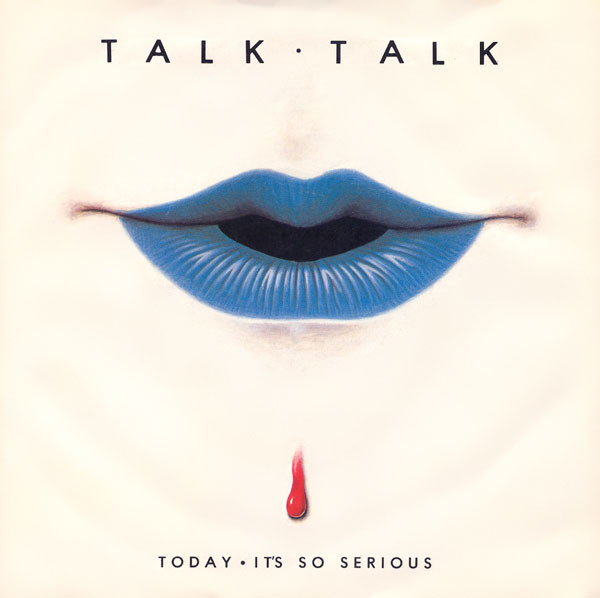

# Today • It's So Serious

By Talk Talk

## Album Data

[Discogs URL](https://www.discogs.com/release/74315-Talk-Talk-Today-Its-So-Serious)

- Label: EMI
- Formats: Vinyl, 7", 45 RPM, Single
- Genres: Electronic, Pop, Synth-pop
- Rating: 4.22
- Released: 1982-06-21
- Year: 1982
- Release ID: 74315
- Media condition: 
- Sleeve condition: 
- Speed: 
- Weight: 
- Notes: 

## Album Tracks

| **Position** | **Title** | **Duration** |
|--------------|-----------|--------------|
| A | **Today** | 3:13 |
| B | **It's So Serious** | 3:19 |

## Artist Roles

| **Name** | **Role** |
|----------|----------|
| **James Marsh** | Illustration [Uncredited] |
| **Nick Webb** | Lacquer Cut By |
| **Mike Robinson** | Mixed By |
| **Hollis-Webb-Brenner-Harris** | Written By |
| **Lee Harris** | Written-By |
| **Mark Hollis** | Written-By |
| **Paul Webb** | Written-By |
| **Simon Brenner** | Written-By |

