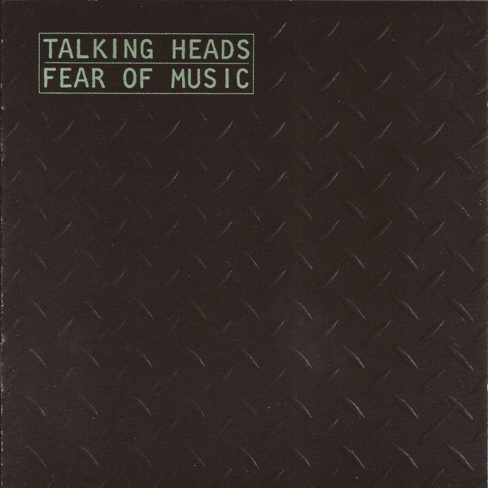

# Fear Of Music

By Talking Heads

## Album Data

[Discogs URL](https://www.discogs.com/release/4783613-Talking-Heads-Fear-Of-Music)

- Label: Rhino Records (2)
Sire
- Formats: Vinyl, LP, Album, Reissue, Remastered
- Genres: Rock
- Rating: 4.56
- Released: 2013
- Year: 1979
- Release ID: 4783613
- Media condition: 
- Sleeve condition: 
- Speed: 
- Weight: 
- Notes: 

## Album Tracks

| **Position** | **Title** | **Duration** |
|--------------|-----------|--------------|
| A1 | **I Zimbra** | 3:06 |
| A2 | **Mind** | 4:12 |
| A3 | **Paper** | 2:36 |
| A4 | **Cities** | 4:05 |
| A5 | **Life During Wartime** | 3:41 |
| A6 | **Memories Can't Wait** | 3:30 |
| B1 | **Air** | 3:33 |
| B2 | **Heaven** | 4:01 |
| B3 | **Animals** | 3:29 |
| B4 | **Electric Guitar** | 2:59 |
| B5 | **Drugs** | 5:13 |

## Artist Roles

| **Name** | **Role** |
|----------|----------|
| **Chris Frantz** | Band |
| **David Byrne** | Band |
| **Jerry Harrison** | Band |
| **Tina Weymouth** | Band |
| **Ace Penna** | Coordinator [Road Coordination] |
| **David Hewitt** | Crew |
| **Fred Ridder** | Crew |
| **Kooster McAllister** | Crew |
| **Phil Gitomer** | Crew |
| **Jerry Harrison** | Design Concept [Cover Concept] |
| **Brian Eno** | Effects [Treatments] |
| **Rod O'Brien** | Engineer |
| **Chris Martinez** | Engineer [Additional Recording And Mixing, Assistant Engineer] |
| **Julie Last** | Engineer [Additional Recording And Mixing, Assistant Engineer] |
| **Tom Heid** | Engineer [Additional Recording And Mixing, Assistant Engineer] |
| **Joe Barbaria** | Engineer [Additional Recording And Mixing] |
| **Neal Teeman** | Engineer [Additional Recording And Mixing] |
| **Rod O'Brien** | Engineer [Additional Recording And Mixing] |
| **Frank Gallagher (4)** | Engineer [Live Sound] |
| **Chris Bellman** | Lacquer Cut By |
| **Gary Kurfirst** | Management |
| **Greg Calbi** | Mastered By |
| **Jerry Harrison** | Photography By [Concept, Help] |
| **David Byrne** | Photography By [Concept] |
| **Jimmy Garcia** | Photography By [Thermograph] |
| **Brian Eno** | Producer |
| **Talking Heads** | Producer |
| **Chris Bellman** | Remastered By |
| **David Byrne** | Written-By |

