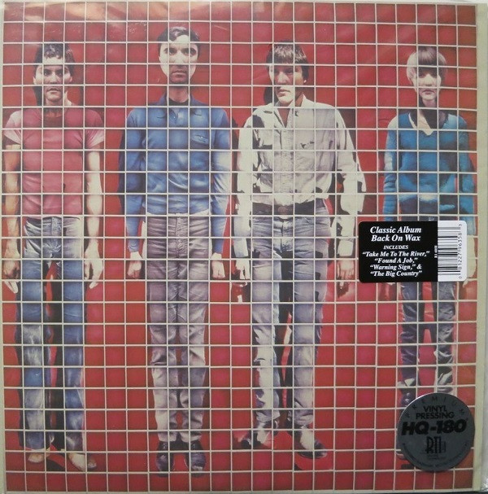

# More Songs About Buildings And Food

By Talking Heads

## Album Data

[Discogs URL](https://www.discogs.com/release/5184307-Talking-Heads-More-Songs-About-Buildings-And-Food)

- Label: Sire
Rhino Records (2)
- Formats: Vinyl, LP, Album, Reissue, Remastered
- Genres: Rock, New Wave, Indie Rock
- Rating: 4.49
- Released: 2013
- Year: 1978
- Release ID: 5184307
- Media condition: 
- Sleeve condition: 
- Speed: 
- Weight: 
- Notes: 

## Album Tracks

| **Position** | **Title** | **Duration** |
|--------------|-----------|--------------|
| A1 | **Thank You For Sending Me An Angel** | 2:11 |
| A2 | **With Our Love** | 3:30 |
| A3 | **The Good Thing** | 3:03 |
| A4 | **Warning Sign** | 3:55 |
| A5 | **The Girls Want To Be With The Girls** | 2:37 |
| A6 | **Found A Job** | 5:00 |
| B1 | **Artists Only** | 3:34 |
| B2 | **I'm Not In Love** | 4:33 |
| B3 | **Stay Hungry** | 2:39 |
| B4 | **Take Me To The River** | 5:00 |
| B5 | **The Big Country** | 5:30 |

## Artist Roles

| **Name** | **Role** |
|----------|----------|
| **Tina Weymouth** | Bass Guitar |
| **David Byrne** | Cover [Concept] |
| **Jimmy de Sana** | Cover [Reproduction] |
| **Chris Frantz** | Drums, Percussion |
| **Rhett Davies** | Engineer |
| **Benjamin Armbrister** | Engineer [Assistant Engineer] |
| **Chris Bellman** | Lacquer Cut By, Remastered By |
| **Joe Gastwirt** | Mastered By |
| **Jerry Harrison** | Piano, Organ, Synthesizer, Guitar, Backing Vocals |
| **Brian Eno** | Producer |
| **Talking Heads** | Producer |
| **Brian Eno** | Synthesizer, Piano, Guitar, Percussion, Backing Vocals |
| **David Byrne** | Vocals, Guitar, Synthesizer [Synthesized Percussion] |

