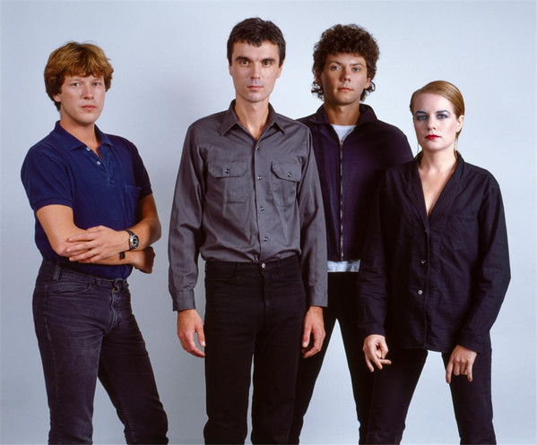

# Talking Heads

## Artist Profile

Talking Heads were an American rock band formed in 1975 in New York City and disbanded in 1991. The band was comprised of David Byrne (lead vocals, guitar), Chris Frantz (drums), Tina Weymouth (bass), and Jerry Harrison (keyboards, guitar). They released eight albums, in addition to several well received live albums.

Inducted into Rock And Roll Hall of Fame in 2002 (Performer).

Genres: New wave, post-punk, art punk, pop rock, art pop, funk rock.

## Artist Links

- [https://talking-heads.nl/](https://talking-heads.nl/)
- [https://myspace.com/talkingheads1](https://myspace.com/talkingheads1)
- [https://en.wikipedia.org/wiki/Talking_Heads](https://en.wikipedia.org/wiki/Talking_Heads)
- [https://www.facebook.com/TalkingHeadsofficial](https://www.facebook.com/TalkingHeadsofficial)
- [https://www.45cat.com/artist/talking-heads](https://www.45cat.com/artist/talking-heads)
- [https://www.imdb.com/name/nm0848088/](https://www.imdb.com/name/nm0848088/)

## See also

- [Fear Of Music](Fear_Of_Music.md)
- [More Songs About Buildings And Food](More_Songs_About_Buildings_And_Food.md)
- [Speaking In Tongues](Speaking_In_Tongues.md)
- [The Name Of This Band Is Talking Heads](The_Name_Of_This_Band_Is_Talking_Heads.md)
