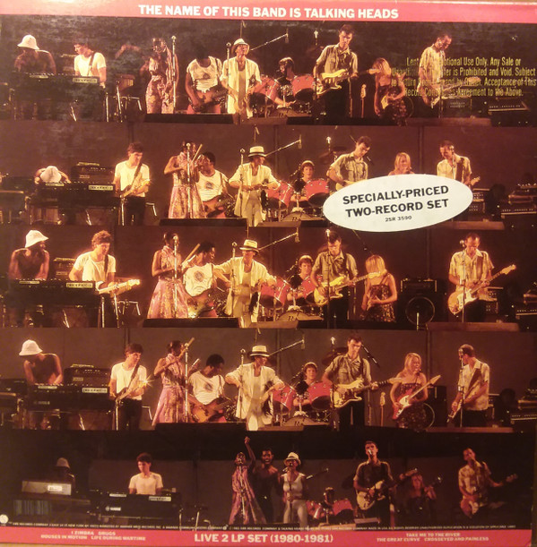

# The Name Of This Band Is Talking Heads

By Talking Heads

## Album Data

[Discogs URL](https://www.discogs.com/release/5140961-Talking-Heads-The-Name-Of-This-Band-Is-Talking-Heads)

- Label: Sire
- Formats: Vinyl, LP, Album, Reissue
- Genres: Rock, Funk / Soul, New Wave, Art Rock, Funk
- Rating: 4.71
- Released: 2013-11-05
- Year: 1982
- Release ID: 5140961
- Media condition: 
- Sleeve condition: 
- Speed: 
- Weight: 
- Notes: 

## Album Tracks

| **Position** | **Title** | **Duration** |
|--------------|-----------|--------------|
|  | **The Name Of This Band Is Talking Heads 1977-1979** |  |
| A1 | **New Feeling** | 3:10 |
| A2 | **A Clean Break** | 4:57 |
| A3 | **Don't Worry About The Government** | 3:08 |
| A4 | **Pulled Up** | 4:08 |
| A5 | **Psycho Killer** | 5:34 |
| B1 | **Artists Only** | 3:48 |
| B2 | **Stay Hungry** | 4:00 |
| B3 | **Air** | 4:09 |
| B4 | **Buildings On Fire** | 3:36 |
| B5 | **Memories (Can't Wait)** | 3:58 |
|  | **The Name Of This Band Is Talking Heads 1980-1981** |  |
| C1 | **I Zimbra** | 3:33 |
| C2 | **Drugs** | 4:47 |
| C3 | **Houses In Motion** | 7:00 |
| C4 | **Life During Wartime** | 5:03 |
| D1 | **The Great Curve** | 6:58 |
| D2 | **Crosseyed And Painless** | 7:05 |
| D3 | **Take Me To The River** | 6:43 |

## Artist Roles

| **Name** | **Role** |
|----------|----------|
| **Tina Weymouth** | Backing Vocals |
| **Tina Weymouth** | Bass |
| **Gloria Veronica Robinson** | Coordinator [Coordination] |
| **Brian Eno** | Crew [Record Plant Truck, Assisted By] |
| **David Hewitt** | Crew [Record Plant Truck] |
| **Kooster McAllister** | Crew [Record Plant Truck] |
| **Rod O'Brien** | Crew [Record Plant Truck] |
| **Gary Scovil** | Crew [Road Crew 1977] |
| **Jeff Jones** | Crew [Road Crew 1977] |
| **Ace Penna** | Crew [Road Crew 1979] |
| **Frank Gallagher (4)** | Crew [Road Crew 1979] |
| **Clive Brinkworth** | Crew [Talking Heads Road Crew 1980-81] |
| **Frank Gallagher (4)** | Crew [Talking Heads Road Crew 1980-81] |
| **Jeff Shaw (2)** | Crew [Talking Heads Road Crew 1980-81] |
| **M&Co.** | Design |
| **Chris Frantz** | Drums |
| **Jerry Harrison** | Keyboards, Guitar, Piano, Backing Vocals |
| **Chris Bellman** | Lacquer Cut By |
| **Gary Kurfirst** | Management |
| **Greg Calbi** | Mastered By |
| **Butch Jones** | Mixed By |
| **Ed Stasium** | Mixed By |
| **Talking Heads** | Mixed By |
| **John Dalton (4)** | Photography By [Cover Photos (1977)] |
| **Lynn Goldsmith** | Photography By [Cover Photos (1981)] |
| **Beverly Price** | Photography By [Inner Sleeve Photos] |
| **Charlie Clough** | Photography By [Inner Sleeve Photos] |
| **Donna Santisi** | Photography By [Inner Sleeve Photos] |
| **Ebet Roberts** | Photography By [Inner Sleeve Photos] |
| **Gary Kurfirst** | Photography By [Inner Sleeve Photos] |
| **Hugh Brown (3)** | Photography By [Inner Sleeve Photos] |
| **Jimmy De Sana** | Photography By [Inner Sleeve Photos] |
| **K.P. Schleinitz** | Photography By [Inner Sleeve Photos] |
| **Lynn Goldsmith** | Photography By [Inner Sleeve Photos] |
| **Marcia Resnick** | Photography By [Inner Sleeve Photos] |
| **Mark Price** | Photography By [Inner Sleeve Photos] |
| **Mark Weiss (3)** | Photography By [Inner Sleeve Photos] |
| **Melissa Hill** | Photography By [Inner Sleeve Photos] |
| **Paul McAlpine** | Photography By [Inner Sleeve Photos] |
| **Robert Grossman** | Photography By [Inner Sleeve Photos] |
| **Tom Ligamari** | Photography By [Inner Sleeve Photos] |
| **Talking Heads** | Producer |
| **Katshuiko Sato** | Recorded By [Tokyo Sun Plaza Recorded By] |
| **David Byrne** | Vocals, Guitar |
| **Brian Eno** | Written-By |
| **Chris Frantz** | Written-By |
| **David Byrne** | Written-By |
| **Hugo Ball** | Written-By |
| **Tina Weymouth** | Written-By |
| **Wayne Zieve** | Written-By |

