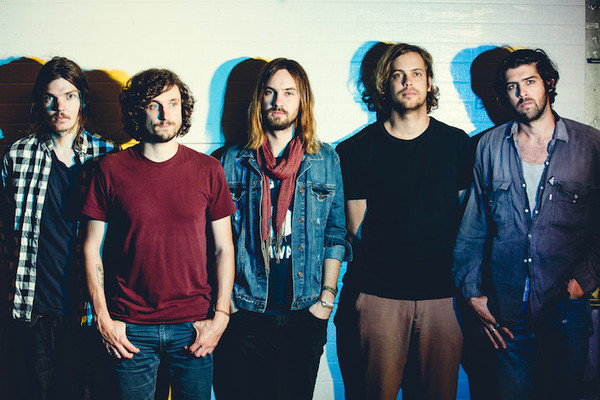

# Tame Impala

## Artist Profile

Tame Impala is the psychedelic rock project of Kevin Parker (2) in the studio, but as a touring act from 2007, Parker plays alongside Jay Watson, Dominic Simper, Julien Barbagallo and Cameron Avery. The band released their critically acclaimed debut album Tame Impala - Innerspeaker, which achieved certified Gold in Australia. The follow up was 2012's Tame Impala - Lonerism receiving a Grammy nomination for Best Alternative Music Album. A third album released in 2015, Tame Impala - Currents, won ARIA Awards for 'Best Rock Album' and 'Album of the Year'.

## Artist Links

- [http://www.tameimpala.com/](http://www.tameimpala.com/)
- [http://www.facebook.com/tameimpala](http://www.facebook.com/tameimpala)
- [http://instagram.com/tame__impala](http://instagram.com/tame__impala)
- [http://myspace.com/tameimpala](http://myspace.com/tameimpala)
- [http://soundcloud.com/tame-impala](http://soundcloud.com/tame-impala)
- [http://twitter.com/tameimpala](http://twitter.com/tameimpala)
- [http://en.wikipedia.org/wiki/Tame_Impala](http://en.wikipedia.org/wiki/Tame_Impala)
- [http://www.youtube.com/user/tameimpalamusic](http://www.youtube.com/user/tameimpalamusic)

## See also

- [Innerspeaker](Innerspeaker.md)
