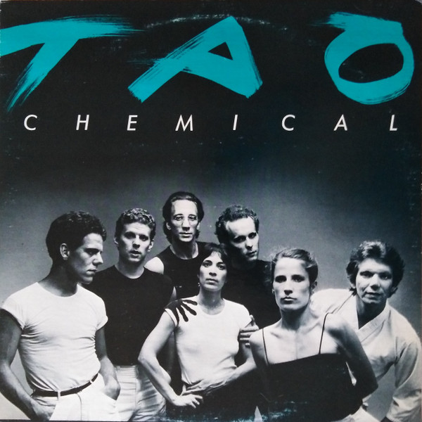

# Tao Chemical

By Tao Chemical

## Album Data

[Discogs URL](https://www.discogs.com/release/2311973-Tao-Chemical-Tao-Chemical)

- Label: Tao Vinyl
- Formats: Vinyl, LP, Album
- Genres: Rock, New Wave, Alternative Rock
- Rating: 5
- Released: 1982
- Year: 1982
- Release ID: 2311973
- Media condition: 
- Sleeve condition: 
- Speed: 
- Weight: 
- Notes: 

## Album Tracks

| **Position** | **Title** | **Duration** |
|--------------|-----------|--------------|
| A1 | **Ain't It Always** |  |
| A2 | **Too Polite** |  |
| A3 | **Mom Said** |  |
| B1 | **Small Town** |  |
| B2 | **Scare Me** |  |
| B3 | **Sick Of Food** |  |

## Artist Roles

| **Name** | **Role** |
|----------|----------|
| **Janet Ring** | Backing Vocals, Engineer |
| **Jim Rutledge (2)** | Bass Guitar, Backing Vocals |
| **B. Modern** | Design [Album] |
| **Beth Regardz** | Design [Album] |
| **Tao Chemical** | Design [Album] |
| **Rick Walker** | Drums, Percussion |
| **Justin Mayer** | Engineer [Basic Tracks, Additional Engineering] |
| **Janet Ring** | Engineer [Basic Tracks] |
| **Noel Gott** | Engineer [Basic Tracks] |
| **Janet Ring** | Engineer [Mixdown, Assisted By] |
| **Rick Walker** | Engineer [Mixdown] |
| **Bill Walker (5)** | Guitar |
| **Not Michael** | Guitar |
| **Rob Brezsny** | Lead Vocals |
| **Marina Shoupe** | Lighting, Set Designer [Stage Design] |
| **Paul Schraub** | Photography By |
| **Bruce Gay (2)** | Technician [Tao Technical] |
| **Paul Abouti** | Technician [Tao Technical] |
| **Tao Chemical** | Written-By, Arranged By, Producer |

