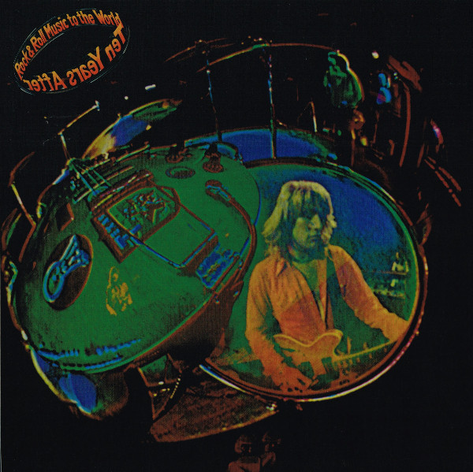

# Rock & Roll Music To The World

By Ten Years After

## Album Data

[Discogs URL](https://www.discogs.com/release/7519812-Ten-Years-After-Rock-Roll-Music-To-The-World)

- Label: Chrysalis
Music On Vinyl
- Formats: Vinyl, LP, Album, Reissue
- Genres: Rock, Blues Rock, Psychedelic Rock
- Rating: 4.46
- Released: 2015-09-28
- Year: 1972
- Release ID: 7519812
- Media condition: 
- Sleeve condition: 
- Speed: 
- Weight: 
- Notes: 

## Album Tracks

| **Position** | **Title** | **Duration** |
|--------------|-----------|--------------|
| A1 | **You Give Me Loving** | 6:31 |
| A2 | **Convention Prevention** | 4:25 |
| A3 | **Turned Off T.V. Blues** | 5:12 |
| A4 | **Standing At The Station** | 7:07 |
| B1 | **You Can't Win Them All** | 4:05 |
| B2 | **Religion** | 5:44 |
| B3 | **Choo Choo Mama** | 4:00 |
| B4 | **Tomorrow I'll Be Out Of Town** | 4:26 |
| B5 | **Rock & Roll Music To The World** | 3:40 |

## Artist Roles

| **Name** | **Role** |
|----------|----------|
| **Leo Lyons** | Bass |
| **Chris Wright** | Coordinator [Executive Co-ordination] |
| **Visualeyes Ltd** | Cover |
| **Ric Lee** | Drums |
| **Chris Kimsey** | Engineer |
| **Alvin Lee** | Guitar |
| **Chick Churchill** | Organ |
| **Brian Cooke (2)** | Photography By [Front And Back] |
| **Alvin Lee** | Photography By [Inside] |
| **Ten Years After** | Producer |
| **Alvin Lee** | Written-By |

