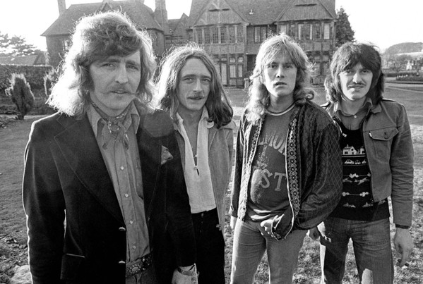

# Ten Years After

## Artist Profile

British blues band. They split up in 1974, but had several reunions (1983, 1988, 1999). "Going Home" was originally released in 1968 but it was the live recording at Woodstock (August 1969) that hit the charts in 1971.

## Artist Links

- [http://www.ten-years-after.co.uk/](http://www.ten-years-after.co.uk/)
- [http://www.tenyearsafternow.com/](http://www.tenyearsafternow.com/)
- [https://www.facebook.com/tenyearsafterband/](https://www.facebook.com/tenyearsafterband/)
- [http://www.ten-years-after.com/](http://www.ten-years-after.com/)
- [https://en.wikipedia.org/wiki/Ten_Years_After](https://en.wikipedia.org/wiki/Ten_Years_After)
- [https://www.imdb.com/name/nm1352332/](https://www.imdb.com/name/nm1352332/)

## See also

- [Rock & Roll Music To The World](Rock_and_Roll_Music_To_The_World.md)
