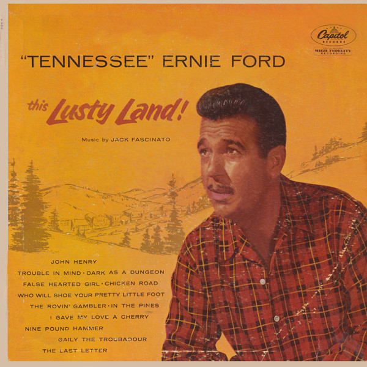

# This Lusty Land!

By Tennessee Ernie Ford

## Album Data

[Discogs URL](https://www.discogs.com/release/4498509-Tennessee-Ernie-Ford-This-Lusty-Land)

- Label: Capitol Records
Capitol Records
- Formats: Vinyl, LP, Album
- Genres: Folk, World, & Country, Country
- Rating: 3.92
- Released: 1955
- Year: 1955
- Release ID: 4498509
- Media condition: 
- Sleeve condition: 
- Speed: 
- Weight: 
- Notes: 

## Album Tracks

| **Position** | **Title** | **Duration** |
|--------------|-----------|--------------|
| A1 | **John Henry** |  |
| A2 | **Trouble In Mind** |  |
| A3 | **Dark As A Dungeon** |  |
| A4 | **False Hearted Girl** |  |
| A5 | **Chicken Road** |  |
| A6 | **Who Will Shoe Your Pretty Little Foot** |  |
| B1 | **The Rovin Gambler** |  |
| B2 | **In The Pines** |  |
| B3 | **I Gave My Love A Cherry** |  |
| B4 | **Nine Pound Hammer** |  |
| B5 | **Gaily The Troubadour** |  |
| B6 | **The Last Letter** |  |

## Artist Roles

| **Name** | **Role** |
|----------|----------|
| **Rolly Bundock** | Bass |
| **Darol Rice** | Bass Clarinet |
| **Darol Rice** | Clarinet |
| **Red Mandel** | Clarinet |
| **Milt Holland** | Drums |
| **Roy Harte** | Drums |
| **Red Mandel** | Flute |
| **Bobby Gibbons** | Guitar |
| **Bobby Gibbons** | Mandolin |
| **Jack Fascinato** | Music By |
| **Ken Veeder** | Photography By [Cover Photo] |
| **Charles Parlato** | Trumpet |

