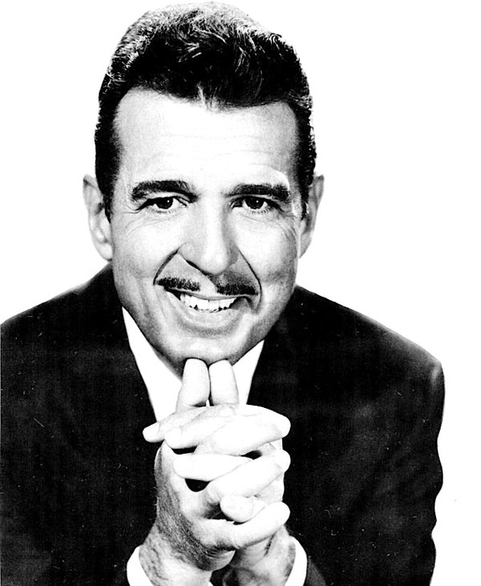

# Tennessee Ernie Ford

## Artist Profile

Born : February 13, 1919 // Bristol, TN, United States 
Died : October 17, 1991 // Reston, VA, United States 
Tennessee Ernie Ford, was a pioneering U.S. recording artist and television host who enjoyed success in the country & western, pop, and gospel musical genres.

## Artist Links

- [http://www.ernieford.com/](http://www.ernieford.com/)
- [https://en.m.wikipedia.org/wiki/Tennessee_Ernie_Ford](https://en.m.wikipedia.org/wiki/Tennessee_Ernie_Ford)

## See also

- [Country Hits...Feelin' Blue](Country_HitsFeelin_Blue.md)
- [This Lusty Land!](This_Lusty_Land!.md)
- [This Must Be The Place](This_Must_Be_The_Place.md)
