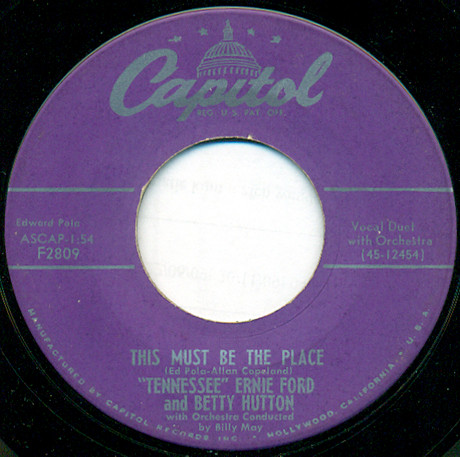

# This Must Be The Place

By Tennessee Ernie Ford

## Album Data

[Discogs URL](https://www.discogs.com/release/3355250-Tennessee-Ernie-Ford-and-Betty-Hutton-This-Must-Be-The-Place)

- Label: Capitol Records
- Formats: Vinyl, 7", Single, 45 RPM
- Genres: Pop, Vocal
- Rating: 3
- Released: 1954
- Year: 1954
- Release ID: 3355250
- Media condition: 
- Sleeve condition: 
- Speed: 
- Weight: 
- Notes: 

## Album Tracks

| **Position** | **Title** | **Duration** |
|--------------|-----------|--------------|
| A | **This Must Be The Place** |  |
| B | **The Honeymoon's Over** |  |

