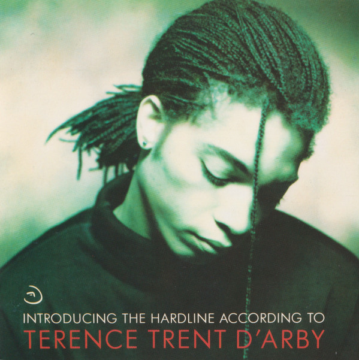

# Introducing The Hardline According To Terence Trent D'Arby

By Terence Trent D'Arby

## Album Data

[Discogs URL](https://www.discogs.com/release/3348540-Terence-Trent-DArby-Introducing-The-Hardline-According-To-Terence-Trent-DArby)

- Label: Columbia
Columbia
- Formats: Vinyl, LP, Album
- Genres: Funk / Soul, Contemporary R&B, Funk
- Rating: 4.01
- Released: 1987
- Year: 1987
- Release ID: 3348540
- Media condition: 
- Sleeve condition: 
- Speed: 
- Weight: 
- Notes: 

## Album Tracks

| **Position** | **Title** | **Duration** |
|--------------|-----------|--------------|
| A1 | **If You All Get To Heaven** | 5:17 |
| A2 | **If You Let Me Stay** | 3:13 |
| A3 | **Wishing Well** | 3:29 |
| A4 | **I'll Never Turn My Back On You (Father's Words)** | 3:36 |
| A5 | **Dance Little Sister** | 3:53 |
| A6 | **Seven More Days** | 4:33 |
| B1 | **Let's Go Forward** | 5:31 |
| B2 | **Rain** | 2:58 |
| B3 | **Sign Your Name** | 4:35 |
| B4 | **As Yet Untitled** | 5:33 |
| B5 | **Who's Lovin' You** | 4:33 |

## Artist Roles

| **Name** | **Role** |
|----------|----------|
| **Ebo Ross** | Backing Vocals |
| **Frank Collins** | Backing Vocals |
| **Glenn Gregory** | Backing Vocals |
| **Lance Ellington** | Backing Vocals |
| **Tony Jackson** | Backing Vocals |
| **Phil Spalding** | Bass |
| **Richard 'Cass' Lewis** | Bass |
| **Sean Oliver** | Bass |
| **Laughing Man** | Chorus |
| **Martyn Ware** | Chorus |
| **Michele Oldland** | Chorus |
| **Phil Legg** | Chorus |
| **Bruce Smith** | Drums |
| **Clive Mngaza** | Drums |
| **Preston Heyman** | Drums |
| **Blast Murray** | Guitar |
| **Christian Marsac** | Guitar |
| **Pete Glenister** | Guitar |
| **Tim Cansfield** | Guitar |
| **Andy Whitmore** | Keyboards |
| **Nick Plytas** | Keyboards |
| **Ivar Ybrad** | Other |
| **Frank Ricotti** | Percussion |
| **Preston Heyman** | Percussion |
| **Christian Marsac** | Saxophone |
| **Mel Collins** | Saxophone |

