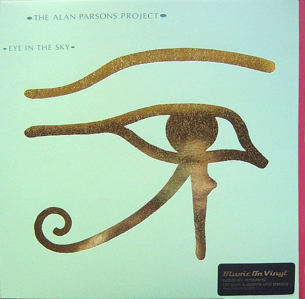

# Eye In The Sky

By The Alan Parsons Project

## Album Data

[Discogs URL](https://www.discogs.com/release/3336428-The-Alan-Parsons-Project-Eye-In-The-Sky)

- Label: Music On Vinyl
Arista
- Formats: Vinyl, LP, Album, Reissue, Remastered
- Genres: Rock, Soft Rock, Pop Rock, Classic Rock
- Rating: 4.44
- Released: 2012-01-09
- Year: 1982
- Release ID: 3336428
- Media condition: 
- Sleeve condition: 
- Speed: 
- Weight: 
- Notes: 

## Album Tracks

| **Position** | **Title** | **Duration** |
|--------------|-----------|--------------|
| A1 | **Sirius (Instrumental)** | 1:48 |
| A2 | **Eye In The Sky** | 4:33 |
| A3 | **Children Of The Moon** | 4:49 |
| A4 | **Gemini** | 2:09 |
| A5 | **Silence And I** | 7:17 |
| B1 | **You're Gonna Get Your Fingers Burned** | 4:19 |
| B2 | **Psychobabble** | 4:50 |
| B3 | **Mammagamma (Instrumental)** | 3:34 |
| B4 | **Step By Step** | 3:52 |
| B5 | **Old And Wise** | 4:52 |

## Artist Roles

| **Name** | **Role** |
|----------|----------|
| **Ian Bairnson** | Acoustic Guitar, Electric Guitar |
| **Andrew Powell** | Arranged By [Orchestra, Choir], Conductor [Orchestra, Choir] |
| **David Paton** | Bass |
| **Robert Howes** | Chorus Master |
| **George Hamer** | Contractor [Orchestral] |
| **Chris Blair** | Coordinator [Production Co-ordinator, Mastering Consultant] |
| **Stuart Elliott** | Drums, Percussion |
| **Tony Richards** | Engineer [Assistant] |
| **Eric Woolfson** | Executive-Producer |
| **Alan Parsons** | Keyboards |
| **Eric Woolfson** | Keyboards |
| **Keith W. Lehman** | Photography By |
| **Alan Parsons** | Producer [Produced By], Engineer [Engineered By], Programmed By [Fairlight] |
| **Mel Collins** | Saxophone |
| **APB (5)** | Sleeve |
| **Colin Chambers (2)** | Sleeve |
| **Hipgnosis (2)** | Sleeve |
| **The English Chorale** | Vocals |
| **Alan Parsons** | Written-By |
| **Eric Woolfson** | Written-By |

